# University Hostel Management System - Architecture Plan

## Project Overview

A full-stack web application for managing university hostels with the following features:

- Multiple hostels (mixed gender)
- Student room booking with preferences
- Automatic hostel and room allocation
- Gender-restricted room assignments
- Role-based access control (Admin/Student)
- Payment tracking (optional)
- Reports and analytics

---

## Roles and Permissions

| Role              | Description          | Permissions                                                                         |
| ----------------- | -------------------- | ----------------------------------------------------------------------------------- |
| **Admin**   | System administrator | CRUD on students, rooms, hostels, bookings; View reports; Approve/Reject bookings   |
| **Student** | Registered student   | Apply for hostel; Select room preferences; View allocated room; View booking status |

### Permission Matrix

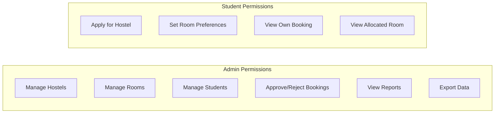

---

## Technology Stack

### Backend

| Technology      | Purpose                        |
| --------------- | ------------------------------ |
| Java 17+        | Programming language           |
| Spring Boot 3.x | Application framework          |
| Spring Data JPA | Database access                |
| Spring Security | Authentication & Authorization |
| MySQL           | Relational database            |
| Maven           | Build tool                     |
| JWT             | Token-based authentication     |

### Frontend

| Technology   | Purpose             |
| ------------ | ------------------- |
| React 18+    | UI framework        |
| Tailwind CSS | Styling             |
| React Router | Client-side routing |
| Axios        | HTTP client         |
| Context API  | State management    |

### Optional Tools

| Tool           | Purpose        |
| -------------- | -------------- |
| Postman        | API testing    |
| GitHub Actions | CI/CD pipeline |

---

## Database Schema

### Entity Relationship Diagram

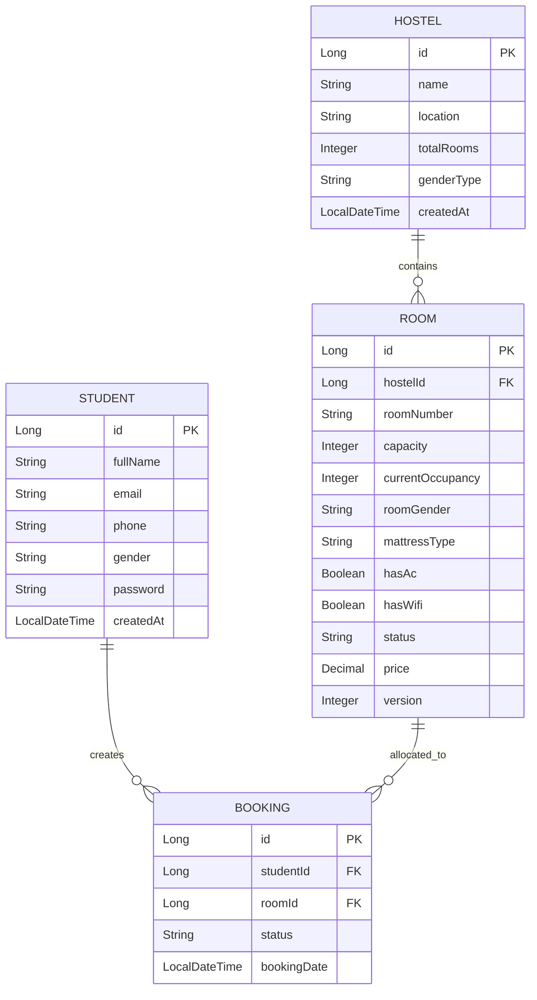

### Table Definitions

#### hostels

| Column      | Type        | Notes                      |
| ----------- | ----------- | -------------------------- |
| id          | PK          | Auto-increment             |
| name        | varchar     | Hostel name                |
| location    | varchar     | Optional                   |
| total_rooms | int         | Optional summary           |
| gender_type | ENUM(MIXED) | Hostel allows both genders |
| created_at  | datetime    | Optional                   |

#### rooms

| Column            | Type                 | Notes              |
| ----------------- | -------------------- | ------------------ |
| id                | PK                   | Auto-increment     |
| hostel_id         | FK → hostels        | Assigned hostel    |
| room_number       | varchar              | e.g., 101          |
| capacity          | int                  | Max occupants      |
| current_occupancy | int                  | Current occupants  |
| room_gender       | ENUM(MALE,FEMALE)    | Single-gender room |
| mattress_type     | ENUM(NORMAL,QUEEN)   | Student preference |
| has_ac            | boolean              | Feature            |
| has_wifi          | boolean              | Feature            |
| status            | ENUM(AVAILABLE,FULL) | Availability       |
| price             | decimal              | Optional           |
| version           | int                  | Default: 0 - JPA Optimistic Locking for preventing double-booking race conditions |

#### students

| Column     | Type              | Notes          |
| ---------- | ----------------- | -------------- |
| id         | PK                | Auto-increment |
| full_name  | varchar           | Student name   |
| email      | varchar           | Unique         |
| phone      | varchar           | Optional       |
| gender     | ENUM(MALE,FEMALE) | Required       |
| password   | varchar           | For login      |
| created_at | datetime          | Optional       |

#### bookings

| Column       | Type                                               | Notes            |
| ------------ | -------------------------------------------------- | ---------------- |
| id           | PK                                                 | Auto-increment   |
| student_id   | FK → students                                     | Student assigned |
| room_id      | FK → rooms                                        | Allocated room   |
| status       | ENUM(PENDING_PAYMENT,APPROVED,REJECTED,CANCELLED,EXPIRED) | Booking status   |
| booking_date | datetime                                           | Auto-generated   |

---

## Room Allocation Logic

The system automatically allocates rooms based on the following algorithm:

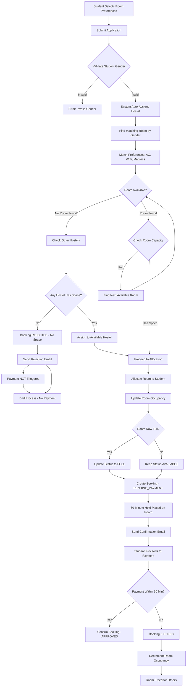

### Background Scheduled Process - Booking Expiration

A cron job runs periodically to check for expired pending payments:

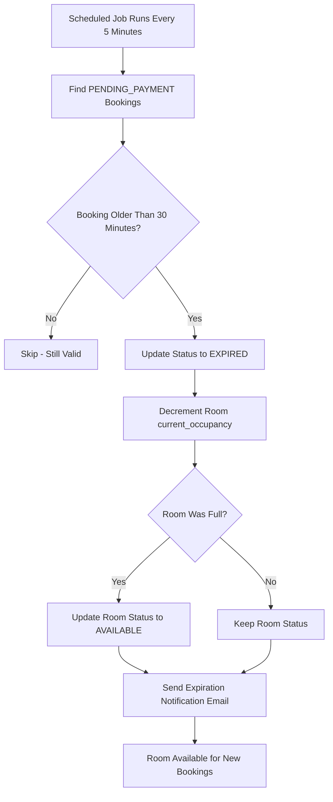

### Conditional Flow Summary

| Condition                     | Booking Status   | Payment Triggered | Email Sent         |
| ----------------------------- | ---------------- | ----------------- | ------------------ |
| Room Available                | PENDING_PAYMENT  | YES - 30min hold  | Confirmation Email |
| Payment Completed             | APPROVED         | COMPLETED         | Payment Confirmed  |
| Payment Timeout - 30 min      | EXPIRED          | CANCELLED         | Expiration Email   |
| Room Full - No Space Anywhere | REJECTED         | NO                | Rejection Email    |
| Invalid Student Data          | ERROR            | NO                | Error Notification |

### Allocation Rules

1. **Student Preference Selection**: Student selects preferences first (mattress, AC, WiFi)
2. **Auto-Assignment**: System automatically assigns hostel and room based on availability
3. **Availability Check**: System checks if room/hostel has space BEFORE creating booking
4. **Gender Enforcement**: All occupants in a room must be the same gender
5. **30-Minute Payment Hold**: When room is allocated, booking is PENDING_PAYMENT with a 30-minute hold
6. **Conditional Payment**: Payment module is ONLY activated when room is successfully allocated
7. **Rejection Handling**: If no room available, booking is rejected WITHOUT triggering payment
8. **Expiration Handling**: Unpaid bookings expire after 30 minutes, freeing the room

### Booking Status Flow

| Status          | Description                      | Payment Status    | Next Action                   |
| --------------- | -------------------------------- | ----------------- | ----------------------------- |
| PENDING_PAYMENT | Room allocated, awaiting payment | PENDING (created) | Student makes payment         |
| APPROVED        | Payment completed successfully   | COMPLETED         | Booking finalized             |
| EXPIRED         | Payment not made within 30 min   | CANCELLED         | Room freed, student can retry |
| REJECTED        | No room available                | NOT CREATED       | Student can reapply later     |
| CANCELLED       | Student/Admin cancelled          | REFUNDED if paid  | Booking closed                |

### Key Business Rules

1. **Room Availability Check First**: System checks room availability BEFORE creating any booking
2. **No Payment on Rejection**: If no room is available, payment module is never activated
3. **30-Minute Payment Window**: Booking starts as PENDING_PAYMENT with a 30-minute hold on the room
4. **Optimistic Locking**: Room version column prevents double-booking race conditions
5. **Auto-Expiration**: Unpaid PENDING_PAYMENT bookings automatically expire after 30 minutes
6. **Scheduled Cleanup**: Background job runs every 5 minutes to process expired bookings

---

## Backend Architecture

### Package Structure

```
com.hostelmanagement
│
├── controller          # REST APIs
│   ├── AdminController.java
│   ├── StudentController.java
│   └── BookingController.java
│
├── service             # Business logic
│   ├── HostelService.java
│   ├── RoomService.java
│   ├── StudentService.java
│   ├── BookingService.java
│   ├── PaymentService.java
│   ├── EmailService.java
│   └── impl/
│       ├── RoomAllocationServiceImpl.java
│       └── BookingServiceImpl.java
│
├── repository          # JPA Repositories
│   ├── HostelRepository.java
│   ├── RoomRepository.java
│   ├── StudentRepository.java
│   └── BookingRepository.java
│
├── model               # Entities
│   ├── Hostel.java
│   ├── Room.java
│   ├── Student.java
│   └── Booking.java
│
├── dto                 # Data Transfer Objects
│   ├── request/
│   │   ├── RoomPreferenceRequest.java
│   │   └── BookingRequest.java
│   └── response/
│       ├── BookingResponse.java
│       └── AllocationResult.java
│
├── security            # Authentication & authorization
│   ├── JwtUtil.java
│   ├── JwtFilter.java
│   └── SecurityConfig.java
│
├── exception           # Custom exceptions
│   ├── ResourceNotFoundException.java
│   ├── NoRoomAvailableException.java
│   └── GlobalExceptionHandler.java
│
├── scheduler           # Scheduled jobs
│   └── BookingExpirationScheduler.java
│
└── util                # Utility classes
    └── AllocationAlgorithm.java
```

---

## Backend Service Implementation Details

### Room Allocation Service

The allocation service implements a **fair, automated distribution algorithm** that prevents students from manipulating hostel choices.

#### Key Design Principles

| Principle               | Implementation                                                |
| ----------------------- | ------------------------------------------------------------- |
| No Student Manipulation | Students cannot select specific hostels - system auto-assigns |
| Fair Distribution       | Occupancy-based allocation across all hostels                 |
| Efficient Multi-Hostel  | Parallel search across all hostels simultaneously             |
| Scalable                | New hostels automatically included in allocation pool         |
| Optimistic Locking      | Version-based concurrency control prevents double-booking     |
| 30-Min Payment Hold     | PENDING_PAYMENT status with automatic expiration              |

#### Allocation Algorithm

```java
package com.hostelmanagement.service.impl;

@Service
@Transactional
public class RoomAllocationServiceImpl implements RoomAllocationService {
  
    @Autowired
    private HostelRepository hostelRepository;
  
    @Autowired
    private RoomRepository roomRepository;
  
    @Autowired
    private BookingRepository bookingRepository;
  
    @Autowired
    private PaymentService paymentService;
  
    @Autowired
    private EmailService emailService;
  
    /**
     * Automated room allocation - Students CANNOT choose hostel
     * System automatically selects best available hostel and room
     */
    public AllocationResult allocateRoom(Student student, RoomPreferenceRequest preferences) {
      
        // Step 1: Validate student gender
        if (student.getGender() == null) {
            return AllocationResult.rejected("Student gender is required for room allocation");
        }
      
        // Step 2: Get ALL active hostels - Student cannot influence this
        List<Hostel> allHostels = hostelRepository.findByActiveTrue();
      
        if (allHostels.isEmpty()) {
            return AllocationResult.rejected("No hostels available in the system");
        }
      
        // Step 3: Find available rooms across ALL hostels simultaneously
        // This ensures fair distribution and efficient searching
        List<Room> availableRooms = findAvailableRoomsAcrossAllHostels(
            allHostels,
            student.getGender(),
            preferences
        );
      
        // Step 4: Check if ANY room is available
        if (availableRooms.isEmpty()) {
            // NO ROOM AVAILABLE - Reject booking, NO payment triggered
            emailService.sendBookingRejectionEmail(student, 
                "No rooms available matching your preferences. Please try again later.");
            return AllocationResult.rejected("No rooms available");
        }
      
        // Step 5: Apply fair distribution algorithm
        // Select room based on balanced distribution, not student preference
        Room selectedRoom = selectRoomByFairDistribution(availableRooms, allHostels);
      
        // Step 6: Room occupancy will be automatically incremented by JPA @PrePersist hook
        // when the booking is saved. Optimistic locking via @Version annotation 
        // will prevent race conditions.
      
        Booking booking = new Booking();
        booking.setStudent(student);
        booking.setRoom(selectedRoom);
        booking.setStatus(BookingStatus.PENDING_PAYMENT);
        booking.setBookingDate(LocalDateTime.now());
      
        try {
            // Step 7: Save booking - @PrePersist hook will automatically increment room occupancy
            bookingRepository.save(booking);
          
        } catch (ObjectOptimisticLockingFailureException ex) {
            // Handle concurrent booking attempts gracefully
            // Another transaction modified this room - retry or reject
            log.warn("Optimistic locking failure for room {}: {}", selectedRoom.getId(), ex.getMessage());
            return AllocationResult.rejected("Room was just booked by another student. Please try again.");
        }
      
        // Step 8: Activate payment module with 30-minute deadline
        Payment payment = paymentService.createPaymentRequest(booking, selectedRoom.getPrice());
      
        // Step 9: Send confirmation email with payment details and deadline
        emailService.sendBookingConfirmationEmail(booking, payment);
      
        return AllocationResult.pendingPayment(booking, payment);
    }
  
    /**
     * Find available rooms across ALL hostels simultaneously
     * Ensures efficient multi-hostel handling
     */
    private List<Room> findAvailableRoomsAcrossAllHostels(
            List<Hostel> hostels, 
            Gender studentGender, 
            RoomPreferenceRequest preferences) {
      
        // Get all hostel IDs for batch query
        List<Long> hostelIds = hostels.stream()
            .map(Hostel::getId)
            .collect(Collectors.toList());
      
        // Single query to find all matching rooms across all hostels
        // Much more efficient than querying each hostel separately
        List<Room> availableRooms = roomRepository.findAvailableRoomsByGenderAndPreferences(
            hostelIds,
            studentGender.name(),
            RoomStatus.AVAILABLE.name(),
            preferences.getHasAc(),
            preferences.getHasWifi(),
            preferences.getMattressType()
        );
      
        return availableRooms;
    }
  
    /**
     * Fair distribution algorithm - prevents hostel manipulation
     * Balances occupancy across all hostels
     */
    private Room selectRoomByFairDistribution(List<Room> availableRooms, List<Hostel> allHostels) {
      
        // Group rooms by hostel
        Map<Long, List<Room>> roomsByHostel = availableRooms.stream()
            .collect(Collectors.groupingBy(room -> room.getHostel().getId()));
      
        // Calculate current occupancy rate for each hostel
        Map<Long, Double> hostelOccupancyRates = new HashMap<>();
      
        for (Hostel hostel : allHostels) {
            Long hostelId = hostel.getId();
            List<Room> hostelRooms = roomRepository.findByHostelId(hostelId);
          
            int totalCapacity = hostelRooms.stream()
                .mapToInt(Room::getCapacity)
                .sum();
          
            int currentOccupancy = hostelRooms.stream()
                .mapToInt(Room::getCurrentOccupancy)
                .sum();
          
            double occupancyRate = totalCapacity > 0 
                ? (double) currentOccupancy / totalCapacity 
                : 0.0;
          
            hostelOccupancyRates.put(hostelId, occupancyRate);
        }
      
        // Select room from hostel with LOWEST occupancy rate
        // This ensures balanced distribution across all hostels
        Room selectedRoom = availableRooms.stream()
            .min(Comparator.comparingDouble(room -> 
                hostelOccupancyRates.get(room.getHostel().getId())))
            .orElse(availableRooms.get(0));
      
        return selectedRoom;
    }
}
```

### Repository Layer with Custom Queries

```java
package com.hostelmanagement.repository;

@Repository
public interface RoomRepository extends JpaRepository<Room, Long> {
  
    /**
     * Efficient query to find available rooms across multiple hostels
     * Single database call instead of N calls for N hostels
     */
    @Query("SELECT r FROM Room r " +
           "WHERE r.hostel.id IN :hostelIds " +
           "AND r.roomGender = :gender " +
           "AND r.status = :status " +
           "AND r.currentOccupancy < r.capacity " +
           "AND (:hasAc IS NULL OR r.hasAc = :hasAc) " +
           "AND (:hasWifi IS NULL OR r.hasWifi = :hasWifi) " +
           "AND (:mattressType IS NULL OR r.mattressType = :mattressType)")
    List<Room> findAvailableRoomsByGenderAndPreferences(
        @Param("hostelIds") List<Long> hostelIds,
        @Param("gender") String gender,
        @Param("status") String status,
        @Param("hasAc") Boolean hasAc,
        @Param("hasWifi") Boolean hasWifi,
        @Param("mattressType") String mattressType
    );
  
    /**
     * Find rooms by hostel for occupancy calculation
     */
    List<Room> findByHostelId(Long hostelId);
  
    /**
     * Count available rooms by hostel
     */
    @Query("SELECT COUNT(r) FROM Room r " +
           "WHERE r.hostel.id = :hostelId " +
           "AND r.status = 'AVAILABLE'")
    int countAvailableRoomsByHostel(@Param("hostelId") Long hostelId);
  
    /**
     * Find rooms by gender across all hostels
     */
    @Query("SELECT r FROM Room r " +
           "WHERE r.roomGender = :gender " +
           "AND r.status = 'AVAILABLE' " +
           "ORDER BY r.hostel.id, r.roomNumber")
    List<Room> findAvailableRoomsByGender(@Param("gender") String gender);
}
```

### Booking Service Implementation

```java
package com.hostelmanagement.service.impl;

@Service
@Transactional
public class BookingServiceImpl implements BookingService {
  
    @Autowired
    private StudentRepository studentRepository;
  
    @Autowired
    private RoomAllocationService allocationService;
  
    @Autowired
    private BookingRepository bookingRepository;
  
    @Autowired
    private PaymentService paymentService;
  
    /**
     * Student applies for hostel - hostel selection is NOT allowed
     * System automatically assigns the best available hostel
     */
    public BookingResponse applyForHostel(Long studentId, RoomPreferenceRequest request) {
      
        // Validate student exists
        Student student = studentRepository.findById(studentId)
            .orElseThrow(() -> new ResourceNotFoundException("Student not found"));
      
        // Check for existing active booking - prevent double booking
        // Active statuses include PENDING_PAYMENT and APPROVED
        Optional<Booking> existingBooking = bookingRepository
            .findByStudentIdAndStatusIn(studentId, 
                Arrays.asList(BookingStatus.PENDING_PAYMENT, BookingStatus.APPROVED));
      
        if (existingBooking.isPresent()) {
            throw new IllegalStateException("Student already has an active booking");
        }
      
        // NOTE: request.hostelId is IGNORED even if provided
        // Students CANNOT manipulate hostel selection
      
        // Perform automated allocation
        AllocationResult result = allocationService.allocateRoom(student, request);
      
        // Build response based on allocation result
        if (result.isRejected()) {
            return BookingResponse.builder()
                .status(BookingStatus.REJECTED)
                .message(result.getMessage())
                .paymentRequired(false)
                .build();
        }
      
        // Room allocated successfully - payment is activated with 30-minute hold
        return BookingResponse.builder()
            .status(BookingStatus.PENDING_PAYMENT)
            .bookingId(result.getBooking().getId())
            .hostelName(result.getBooking().getRoom().getHostel().getName())
            .roomNumber(result.getBooking().getRoom().getRoomNumber())
            .paymentRequired(true)
            .paymentId(result.getPayment().getId())
            .amount(result.getPayment().getAmount())
            .paymentDueDate(result.getPayment().getDueDate())
            .message("Room allocated! Please complete payment within 30 minutes.")
            .build();
    }
}
```

### Allocation Result DTO

```java
package com.hostelmanagement.dto.response;

@Data
@Builder
public class AllocationResult {
  
    private BookingStatus status;
    private Booking booking;
    private Payment payment;
    private String message;
    private boolean paymentRequired;
  
    public static AllocationResult pendingPayment(Booking booking, Payment payment) {
        return AllocationResult.builder()
            .status(BookingStatus.PENDING_PAYMENT)
            .booking(booking)
            .payment(payment)
            .message("Room allocated successfully. Please complete payment within 30 minutes.")
            .paymentRequired(true)
            .build();
    }
  
    public static AllocationResult rejected(String message) {
        return AllocationResult.builder()
            .status(BookingStatus.REJECTED)
            .message(message)
            .paymentRequired(false)
            .build();
    }
  
    public boolean isRejected() {
        return status == BookingStatus.REJECTED;
    }
}
```

### JPA Lifecycle Hooks for Room Occupancy

The `Booking` entity uses JPA lifecycle hooks to strictly control the `current_occupancy` tally on the `Room` entity, preventing data denormalization and drift:

```java
package com.hostelmanagement.model;

@Entity
@Table(name = "bookings")
public class Booking {
  
    // ... other fields ...
  
    @ManyToOne(fetch = FetchType.LAZY)
    @JoinColumn(name = "room_id", nullable = false)
    private Room room;
  
    @Transient
    private BookingStatus previousStatus;
  
    /**
     * Called after entity is loaded from database.
     * Stores the current status for later comparison in @PreUpdate.
     */
    @PostLoad
    public void postLoad() {
        this.previousStatus = this.status;
    }
  
    /**
     * Called before a new booking is persisted.
     * For new bookings with PENDING_PAYMENT status, increment room occupancy.
     */
    @PrePersist
    public void prePersist() {
        if (this.room != null && this.status == BookingStatus.PENDING_PAYMENT) {
            incrementRoomOccupancy();
        }
    }
  
    /**
     * Called before an existing booking is updated.
     * Handles status transitions that affect room occupancy:
     * - PENDING_PAYMENT/APPROVED -> EXPIRED/CANCELLED/REJECTED: decrement occupancy
     * - EXPIRED/CANCELLED/REJECTED -> PENDING_PAYMENT/APPROVED: increment occupancy
     */
    @PreUpdate
    public void preUpdate() {
        if (this.previousStatus != null && this.previousStatus != this.status) {
            handleOccupancyChange(previousStatus, this.status);
        }
    }
  
    /**
     * Called before a booking is removed.
     * Decrements occupancy if the booking was in an active state.
     */
    @PreRemove
    public void preRemove() {
        if (this.status == BookingStatus.PENDING_PAYMENT || 
            this.status == BookingStatus.APPROVED) {
            decrementRoomOccupancy();
        }
    }
  
    private void handleOccupancyChange(BookingStatus oldStatus, BookingStatus newStatus) {
        boolean wasOccupying = (oldStatus == BookingStatus.PENDING_PAYMENT || 
                                oldStatus == BookingStatus.APPROVED);
        boolean nowOccupying = (newStatus == BookingStatus.PENDING_PAYMENT || 
                                newStatus == BookingStatus.APPROVED);
      
        if (!wasOccupying && nowOccupying) {
            incrementRoomOccupancy();
        } else if (wasOccupying && !nowOccupying) {
            decrementRoomOccupancy();
        }
    }
  
    private void incrementRoomOccupancy() {
        if (this.room != null) {
            this.room.setCurrentOccupancy(this.room.getCurrentOccupancy() + 1);
            if (this.room.getCurrentOccupancy() >= this.room.getCapacity()) {
                this.room.setStatus(RoomStatus.FULL);
            }
        }
    }
  
    private void decrementRoomOccupancy() {
        if (this.room != null) {
            this.room.setCurrentOccupancy(Math.max(0, this.room.getCurrentOccupancy() - 1));
            if (this.room.getCurrentOccupancy() < this.room.getCapacity()) {
                this.room.setStatus(RoomStatus.AVAILABLE);
            }
        }
    }
}
```

> **Important:** The JPA lifecycle hooks ensure that room occupancy is always in sync with booking status:
> - `@PrePersist`: Increments occupancy for new PENDING_PAYMENT bookings
> - `@PreUpdate`: Handles status transitions (e.g., PENDING_PAYMENT → EXPIRED frees the room)
> - `@PreRemove`: Decrements occupancy when an active booking is deleted
> - `@PostLoad`: Required to track previous status for update detection

### Room Entity with Optimistic Locking

```java
package com.hostelmanagement.model;

@Entity
@Table(name = "rooms")
public class Room {
  
    // ... other fields ...
  
    @Version
    @Column(name = "version")
    private Integer version;
  
    // Getters and setters
}
```

### Global Exception Handler

Centralized exception handling using `@RestControllerAdvice` to return standardized JSON error responses:

```java
package com.hostelmanagement.exception;

@RestControllerAdvice
public class GlobalExceptionHandler {
  
    private static final Logger log = LoggerFactory.getLogger(GlobalExceptionHandler.class);
  
    /**
     * Handle resource not found exceptions
     */
    @ExceptionHandler(ResourceNotFoundException.class)
    public ResponseEntity<ErrorResponse> handleResourceNotFound(ResourceNotFoundException ex) {
        ErrorResponse error = new ErrorResponse(
            "RESOURCE_NOT_FOUND",
            ex.getMessage(),
            LocalDateTime.now()
        );
        return ResponseEntity.status(HttpStatus.NOT_FOUND).body(error);
    }
  
    /**
     * Handle no room available exceptions
     */
    @ExceptionHandler(NoRoomAvailableException.class)
    public ResponseEntity<ErrorResponse> handleNoRoomAvailable(NoRoomAvailableException ex) {
        ErrorResponse error = new ErrorResponse(
            "NO_ROOM_AVAILABLE",
            ex.getMessage(),
            LocalDateTime.now()
        );
        return ResponseEntity.status(HttpStatus.NOT_FOUND).body(error);
    }
  
    /**
     * Handle optimistic locking failures - concurrent booking attempts
     */
    @ExceptionHandler(ObjectOptimisticLockingFailureException.class)
    public ResponseEntity<ErrorResponse> handleOptimisticLockingFailure(
            ObjectOptimisticLockingFailureException ex) {
        log.warn("Optimistic locking failure: {}", ex.getMessage());
        ErrorResponse error = new ErrorResponse(
            "CONCURRENT_MODIFICATION",
            "This room was just booked by another student. Please try again.",
            LocalDateTime.now()
        );
        return ResponseEntity.status(HttpStatus.CONFLICT).body(error);
    }
  
    /**
     * Handle validation errors
     */
    @ExceptionHandler(MethodArgumentNotValidException.class)
    public ResponseEntity<ErrorResponse> handleValidationErrors(MethodArgumentNotValidException ex) {
        List<String> errors = ex.getBindingResult()
            .getFieldErrors()
            .stream()
            .map(error -> error.getField() + ": " + error.getDefaultMessage())
            .collect(Collectors.toList());
      
        ErrorResponse error = new ErrorResponse(
            "VALIDATION_ERROR",
            "Invalid request parameters",
            LocalDateTime.now(),
            errors
        );
        return ResponseEntity.status(HttpStatus.BAD_REQUEST).body(error);
    }
  
    /**
     * Handle illegal state exceptions
     */
    @ExceptionHandler(IllegalStateException.class)
    public ResponseEntity<ErrorResponse> handleIllegalState(IllegalStateException ex) {
        ErrorResponse error = new ErrorResponse(
            "INVALID_STATE",
            ex.getMessage(),
            LocalDateTime.now()
        );
        return ResponseEntity.status(HttpStatus.BAD_REQUEST).body(error);
    }
  
    /**
     * Handle all other exceptions
     */
    @ExceptionHandler(Exception.class)
    public ResponseEntity<ErrorResponse> handleGenericException(Exception ex) {
        log.error("Unexpected error occurred", ex);
        ErrorResponse error = new ErrorResponse(
            "INTERNAL_ERROR",
            "An unexpected error occurred. Please try again later.",
            LocalDateTime.now()
        );
        return ResponseEntity.status(HttpStatus.INTERNAL_SERVER_ERROR).body(error);
    }
}

/**
 * Standardized error response DTO
 */
@Data
@AllArgsConstructor
@NoArgsConstructor
class ErrorResponse {
    private String code;
    private String message;
    private LocalDateTime timestamp;
    private List<String> details;
  
    public ErrorResponse(String code, String message, LocalDateTime timestamp) {
        this.code = code;
        this.message = message;
        this.timestamp = timestamp;
        this.details = null;
    }
}
```

### Booking Expiration Scheduler

Background scheduled process to handle expired PENDING_PAYMENT bookings:

```java
package com.hostelmanagement.scheduler;

@Component
public class BookingExpirationScheduler {
  
    private static final Logger log = LoggerFactory.getLogger(BookingExpirationScheduler.class);
    private static final int PAYMENT_TIMEOUT_MINUTES = 30;
  
    @Autowired
    private BookingRepository bookingRepository;
  
    @Autowired
    private EmailService emailService;
  
    /**
     * Run every 5 minutes to check for expired bookings
     * Note: Room occupancy is automatically decremented by @PreUpdate hook
     * when booking status changes from PENDING_PAYMENT to EXPIRED
     */
    @Scheduled(cron = "0 */5 * * * ?")
    @Transactional
    public void processExpiredBookings() {
        log.info("Running booking expiration check...");
      
        // Find all PENDING_PAYMENT bookings older than 30 minutes
        LocalDateTime expirationThreshold = LocalDateTime.now().minusMinutes(PAYMENT_TIMEOUT_MINUTES);
        List<Booking> expiredBookings = bookingRepository
            .findByStatusAndBookingDateBefore(BookingStatus.PENDING_PAYMENT, expirationThreshold);
      
        log.info("Found {} expired bookings to process", expiredBookings.size());
      
        for (Booking booking : expiredBookings) {
            try {
                // Update booking status to EXPIRED
                // The @PreUpdate hook will automatically decrement room occupancy
                booking.setStatus(BookingStatus.EXPIRED);
                bookingRepository.save(booking);
              
                // Send expiration notification email
                emailService.sendBookingExpirationEmail(booking);
              
                log.info("Expired booking {} and freed room {}", 
                    booking.getId(), booking.getRoom().getRoomNumber());
              
            } catch (Exception e) {
                log.error("Error processing expired booking {}: {}", 
                    booking.getId(), e.getMessage());
            }
        }
    }
}
```

> **Note:** The scheduler only updates the booking status. The JPA `@PreUpdate` lifecycle hook on the `Booking` entity automatically handles the room occupancy decrement when the status transitions from `PENDING_PAYMENT` to `EXPIRED`. This ensures data consistency and prevents double-decrement issues.

### Booking Response DTO

```java
package com.hostelmanagement.dto.response;

@Data
@Builder
public class BookingResponse {
  
    private BookingStatus status;
    private String message;
    private Long bookingId;
    private String hostelName;
    private String roomNumber;
    private boolean paymentRequired;
  
    // Payment details - only populated if room allocated
    private Long paymentId;
    private BigDecimal amount;
    private LocalDateTime paymentDueDate;
  
    public static BookingResponse rejected(String message) {
        return BookingResponse.builder()
            .status(BookingStatus.REJECTED)
            .message(message)
            .paymentRequired(false)
            .build();
    }
}
```

### Room Preference Request DTO

```java
package com.hostelmanagement.dto.request;

@Data
public class RoomPreferenceRequest {
  
    // NOTE: hostelId is NOT included - students cannot choose hostel
    // The system automatically assigns the best available hostel
  
    private MattressType mattressType;  // NORMAL or QUEEN
    private Boolean hasAc;              // AC preference
    private Boolean hasWifi;            // WiFi preference
    private String specialRequests;     // Optional special requests
}
```

### Scalability Features

```java
/**
 * The allocation algorithm is designed to scale efficiently:
 * 
 * 1. NEW HOSTELS: Simply add a new hostel record to the database
 *    - No code changes required
 *    - Automatically included in allocation pool
 * 
 * 2. BATCH QUERIES: Single query fetches rooms from all hostels
 *    - O(1) database calls regardless of hostel count
 *    - Prevents N+1 query problem
 * 
 * 3. FAIR DISTRIBUTION: Occupancy-based selection
 *    - New hostels start with 0% occupancy
 *    - Automatically get priority in allocation
 *    - Balances load across all hostels
 * 
 * 4. NO STUDENT MANIPULATION:
 *    - Students cannot specify hostel preference
 *    - System controls all allocation decisions
 *    - Prevents gaming of the system
 */
```

### Service Layer Summary

| Service               | Responsibility            | Key Methods                                                         |
| --------------------- | ------------------------- | ------------------------------------------------------------------- |
| RoomAllocationService | Automated room assignment | `allocateRoom()`, `selectRoomByFairDistribution()`              |
| BookingService        | Booking management        | `applyForHostel()`, `cancelBooking()`                           |
| PaymentService        | Payment processing        | `createPaymentRequest()`, `confirmPayment()`                    |
| EmailService          | Notifications             | `sendBookingConfirmationEmail()`, `sendBookingRejectionEmail()` |
| HostelService         | Hostel CRUD               | `createHostel()`, `getAllHostels()`                             |
| RoomService           | Room CRUD                 | `createRoom()`, `updateRoomStatus()`                            |

### Spring Boot Dependencies

```xml
<!-- Core Dependencies -->
<dependency>
    <groupId>org.springframework.boot</groupId>
    <artifactId>spring-boot-starter-web</artifactId>
</dependency>

<dependency>
    <groupId>org.springframework.boot</groupId>
    <artifactId>spring-boot-starter-data-jpa</artifactId>
</dependency>

<dependency>
    <groupId>org.springframework.boot</groupId>
    <artifactId>spring-boot-starter-security</artifactId>
</dependency>

<dependency>
    <groupId>com.mysql</groupId>
    <artifactId>mysql-connector-j</artifactId>
    <scope>runtime</scope>
</dependency>

<!-- JWT Authentication -->
<dependency>
    <groupId>io.jsonwebtoken</groupId>
    <artifactId>jjwt-api</artifactId>
    <version>0.12.3</version>
</dependency>

<!-- Validation -->
<dependency>
    <groupId>org.springframework.boot</groupId>
    <artifactId>spring-boot-starter-validation</artifactId>
</dependency>

<!-- Lombok -->
<dependency>
    <groupId>org.projectlombok</groupId>
    <artifactId>lombok</artifactId>
    <optional>true</optional>
</dependency>
```

---

## Frontend Architecture

### Folder Structure

```
src/
├── components/
│   ├── Admin/
│   │   ├── ManageHostels.js
│   │   ├── ManageRooms.js
│   │   └── ViewReports.js
│   ├── Student/
│   │   ├── ApplyHostel.js
│   │   ├── RoomPreferences.js
│   │   └── MyBooking.js
│   └── Shared/
│       ├── Navbar.js
│       └── Footer.js
│
├── pages/
│   ├── AdminDashboard.js
│   ├── StudentDashboard.js
│   └── Login.js
│
├── services/
│   ├── api.js           # Axios base config
│   ├── authService.js
│   ├── bookingService.js
│   └── roomService.js
│
├── context/
│   └── AuthContext.js   # Store user login & role
│
└── App.js
```

---

## Frontend UI Components and Pages

### Page Layout Overview

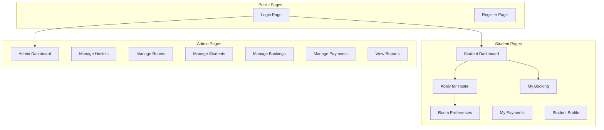

### Complete Frontend Structure

```
src/
├── components/
│   ├── common/
│   │   ├── Navbar.js              # Navigation bar with role-based menu
│   │   ├── Sidebar.js             # Side navigation for dashboard
│   │   ├── Footer.js              # Page footer
│   │   ├── LoadingSpinner.js      # Loading indicator
│   │   ├── Alert.js               # Alert/notification component
│   │   ├── Modal.js               # Reusable modal dialog
│   │   ├── Button.js              # Styled button component
│   │   ├── Input.js               # Form input component
│   │   ├── Select.js              # Dropdown select component
│   │   ├── Card.js                # Card container component
│   │   ├── Table.js               # Data table component
│   │   ├── Pagination.js          # Pagination controls
│   │   └── SearchBar.js           # Search input component
│   │
│   ├── layout/
│   │   ├── AdminLayout.js         # Admin pages wrapper
│   │   ├── StudentLayout.js       # Student pages wrapper
│   │   └── PublicLayout.js        # Login/Register wrapper
│   │
│   ├── auth/
│   │   ├── LoginForm.js           # Login form
│   │   ├── RegisterForm.js        # Student registration form
│   │   └── ProtectedRoute.js      # Route guard component
│   │
│   ├── admin/
│   │   ├── AdminSidebar.js        # Admin navigation menu
│   │   ├── DashboardCards.js      # KPI cards for dashboard
│   │   ├── HostelForm.js          # Create/Edit hostel form
│   │   ├── HostelList.js          # List of hostels table
│   │   ├── HostelCard.js          # Single hostel card
│   │   ├── RoomForm.js            # Create/Edit room form
│   │   ├── RoomList.js            # List of rooms table
│   │   ├── RoomCard.js            # Single room card
│   │   ├── StudentList.js         # List of students table
│   │   ├── StudentDetails.js      # Student detail view
│   │   ├── BookingList.js         # List of bookings table
│   │   ├── BookingDetails.js      # Booking detail modal
│   │   ├── BookingActions.js      # Approve/Reject buttons
│   │   ├── PaymentList.js         # List of payments table
│   │   └── PaymentActions.js      # Confirm/Refund buttons
│   │
│   ├── student/
│   │   ├── StudentSidebar.js      # Student navigation menu
│   │   ├── HostelApplication.js   # Hostel application form
│   │   ├── PreferenceForm.js      # Room preference selection
│   │   ├── PreferenceCard.js      # Display selected preferences
│   │   ├── BookingStatus.js       # Booking status display
│   │   ├── RoomDetails.js         # Allocated room information
│   │   ├── PaymentForm.js         # Payment submission form
│   │   ├── PaymentHistory.js      # Payment history list
│   │   └── ProfileForm.js         # Edit profile form
│   │
│   ├── reports/
│   │   ├── ReportFilters.js       # Date range and filters
│   │   ├── OccupancyChart.js      # Bar chart for occupancy
│   │   ├── GenderChart.js         # Pie chart for gender
│   │   ├── BookingTrendsChart.js  # Line chart for trends
│   │   ├── RoomStatusChart.js     # Donut chart for status
│   │   ├── OccupancyReport.js     # Occupancy report table
│   │   ├── StudentReport.js       # Student report table
│   │   ├── RoomReport.js          # Room report table
│   │   ├── MonthlyStats.js        # Monthly statistics
│   │   └── ExportButtons.js       # PDF/Excel export
│   │
│   └── shared/
│       ├── Navbar.js              # Main navigation
│       ├── Footer.js              # Page footer
│       ├── ErrorBoundary.js       # Error handling wrapper
│       └── NotFound.js            # 404 page
│
├── pages/
│   ├── public/
│   │   ├── LoginPage.js           # Login page
│   │   └── RegisterPage.js        # Registration page
│   │
│   ├── student/
│   │   ├── StudentDashboard.js    # Student home dashboard
│   │   ├── ApplyHostelPage.js     # Apply for hostel
│   │   ├── MyBookingPage.js       # View booking status
│   │   ├── MyPaymentsPage.js      # Payment history
│   │   └── ProfilePage.js         # Student profile
│   │
│   └── admin/
│       ├── AdminDashboard.js      # Admin home dashboard
│       ├── ManageHostelsPage.js   # Hostel management
│       ├── ManageRoomsPage.js     # Room management
│       ├── ManageStudentsPage.js  # Student management
│       ├── ManageBookingsPage.js  # Booking management
│       ├── ManagePaymentsPage.js  # Payment management
│       └── ReportsPage.js         # Reports and analytics
│
├── services/
│   ├── api.js                     # Axios instance with interceptors
│   ├── authService.js             # Authentication API calls
│   ├── hostelService.js           # Hostel API calls
│   ├── roomService.js             # Room API calls
│   ├── studentService.js          # Student API calls
│   ├── bookingService.js          # Booking API calls
│   └── paymentService.js          # Payment API calls
│
├── context/
│   ├── AuthContext.js             # Authentication state
│   └── AlertContext.js            # Alert/notification state
│
├── hooks/
│   ├── useAuth.js                 # Authentication hook
│   ├── useAlert.js                # Alert hook
│   ├── useFetch.js                # Data fetching hook
│   └── useForm.js                 # Form handling hook
│
├── utils/
│   ├── constants.js               # App constants
│   ├── validators.js              # Form validation functions
│   ├── formatters.js              # Date/number formatters
│   └── helpers.js                 # Utility functions
│
├── styles/
│   └── index.css                  # Tailwind CSS imports
│
├── App.js                         # Main app component
└── index.js                       # Entry point
```

---

## Page Designs and Components

### 1. Login Page

```
┌─────────────────────────────────────────────────────────────┐
│                      UNIVERSITY LOGO                         │
│              Hostel Management System                        │
├─────────────────────────────────────────────────────────────┤
│                                                             │
│     ┌─────────────────────────────────────────────┐        │
│     │              Login                          │        │
│     │                                              │        │
│     │  Email: [________________________]          │        │
│     │                                              │        │
│     │  Password: [________________________]       │        │
│     │                                              │        │
│     │  [ ] Remember me                             │        │
│     │                                              │        │
│     │  [        LOGIN BUTTON        ]              │        │
│     │                                              │        │
│     │  Don't have an account? Register            │        │
│     └─────────────────────────────────────────────┘        │
│                                                             │
└─────────────────────────────────────────────────────────────┘
```

**Components Used:**

- `PublicLayout` - Centered card wrapper
- `LoginForm` - Email/password form with validation
- `Alert` - Error message display

### 2. Student Dashboard

```
┌─────────────────────────────────────────────────────────────┐
│  LOGO  │  Student Dashboard  │         John Doe  │ Logout  │
├──────────────┬──────────────────────────────────────────────┤
│              │                                              │
│  Dashboard   │  Welcome, John!                              │
│              │                                              │
│  Apply for   │  ┌────────────┐ ┌────────────┐              │
│  Hostel      │  │  Booking   │ │  Payment   │              │
│              │  │  Status    │ │  Status    │              │
│  My Booking  │  │            │ │            │              │
│              │  │ PENDING_PAYMENT │ │ PENDING    │         │
│  My Payments │  └────────────┘ └────────────┘              │
│              │                                              │
│  Profile     │  Your Allocated Room                         │
│              │  ┌────────────────────────────────────┐      │
│              │  │ Hostel A  │  Room 101              │      │
│              │  │ Floor 1   │  Male Wing             │      │
│              │  │ AC: Yes   │  WiFi: Yes             │      │
│              │  └────────────────────────────────────┘      │
│              │                                              │
│              │  Quick Actions                               │
│              │  [Apply for Hostel]  [View Booking]          │
│              │                                              │
└──────────────┴──────────────────────────────────────────────┘
```

**Components Used:**

- `StudentLayout` - Sidebar + content wrapper
- `StudentSidebar` - Navigation menu
- `DashboardCards` - Status cards
- `RoomDetails` - Allocated room info
- `Button` - Action buttons

### 3. Apply for Hostel Page

```
┌─────────────────────────────────────────────────────────────┐
│  LOGO  │  Apply for Hostel  │              John Doe  │ Logout│
├──────────────┬──────────────────────────────────────────────┤
│              │                                              │
│  Dashboard   │  Apply for Hostel                            │
│              │                                              │
│  Apply for   │  Step 1: Select Preferences                  │
│  Hostel      │  ━━━━━━━━━━━━━━━○───────────────             │
│              │                                              │
│  My Booking  │  ┌────────────────────────────────────┐      │
│              │  │ Room Preferences                   │      │
│  My Payments │  │                                    │      │
│              │  │ Hostel: (auto-assigned by system)  │      │
│  Profile     │  │                                    │      │
│              │  │ Mattress Type:                     │      │
│              │  │  ○ Normal   ○ Queen                │      │
│              │  │                                    │      │
│              │  │ Features Required:                 │      │
│              │  │  ☑ Air Conditioning                │      │
│              │  │  ☑ WiFi                            │      │
│              │  │                                    │      │
│              │  │ Special Requests:                  │      │
│              │  │  [________________________]        │      │
│              │  │                                    │      │
│              │  │ [Back]           [Next Step →]     │      │
│              │  └────────────────────────────────────┘      │
│              │                                              │
└──────────────┴──────────────────────────────────────────────┘
```

Note: System will auto-assign the hostel/room based on preferences and availability.

**Components Used:**

- `StudentLayout` - Page wrapper
- `PreferenceForm` - Multi-step form
- `Input` - Text inputs
- `Button` - Navigation buttons

### 4. Admin Dashboard

```
┌─────────────────────────────────────────────────────────────┐
│  LOGO  │  Admin Dashboard  │            Admin User  │ Logout │
├──────────────┬──────────────────────────────────────────────┤
│              │                                              │
│  Dashboard   │  Dashboard Overview                          │
│              │                                              │
│  Hostels     │  ┌────────┐ ┌────────┐ ┌────────┐ ┌────────┐│
│              │  │Hostels │ │ Rooms  │ │Students│ │Bookings││
│  Rooms       │  │   5    │ │  250   │ │  450   │ │  380   ││
│              │  └────────┘ └────────┘ └────────┘ └────────┘│
│  Students    │                                              │
│              │  Occupancy by Hostel                         │
│  Bookings    │  ┌────────────────────────────────────┐      │
│              │  │  ████████████████████ 84%          │      │
│  Payments    │  │  ██████████████ 72%                │      │
│              │  │  █████████████████████ 91%         │      │
│  Reports     │  └────────────────────────────────────┘      │
│              │                                              │
│  Settings    │  Recent Bookings                             │
│              │  ┌────────────────────────────────────────┐  │
│              │  │ Student    │ Hostel  │ Room │ Status  │  │
│              │  │ John Doe   │ Hostel A│ 101  │ PENDING_PAYMENT │  │
│              │  │ Jane Smith │ Hostel B│ 205  │ APPROVED│  │
│              │  └────────────────────────────────────────┘  │
│              │                                              │
└──────────────┴──────────────────────────────────────────────┘
```

**Components Used:**

- `AdminLayout` - Sidebar + content wrapper
- `AdminSidebar` - Navigation menu
- `DashboardCards` - KPI cards
- `OccupancyChart` - Bar chart
- `BookingList` - Recent bookings table

### 5. Manage Hostels Page

```
┌─────────────────────────────────────────────────────────────┐
│  LOGO  │  Manage Hostels  │             Admin User  │ Logout │
├──────────────┬──────────────────────────────────────────────┤
│              │                                              │
│  Dashboard   │  Manage Hostels                              │
│              │                                              │
│  Hostels     │  [+ Add New Hostel]  [Search...    ] [🔍]   │
│              │                                              │
│  Rooms       │  ┌────────────────────────────────────────┐  │
│              │  │ Name       │ Location │ Rooms │ Actions│  │
│  Students    │  ├────────────────────────────────────────┤  │
│              │  │ Hostel A   │ Block 1  │  50   │ ✏️ 🗑️  │  │
│  Bookings    │  │ Hostel B   │ Block 2  │  75   │ ✏️ 🗑️  │  │
│              │  │ Hostel C   │ Block 3  │  60   │ ✏️ 🗑️  │  │
│  Payments    │  │ Hostel D   │ Block 4  │  40   │ ✏️ 🗑️  │  │
│              │  └────────────────────────────────────────┘  │
│  Reports     │                                              │
│              │  Showing 1-5 of 5 hostels                    │
│  Settings    │                                              │
│              │                                              │
└──────────────┴──────────────────────────────────────────────┘
```

**Components Used:**

- `AdminLayout` - Page wrapper
- `Button` - Add new button
- `SearchBar` - Search input
- `HostelList` - Data table
- `Table` - Sortable table
- `Pagination` - Page controls

### 6. Manage Rooms Page

```
┌─────────────────────────────────────────────────────────────┐
│  LOGO  │  Manage Rooms  │              Admin User  │ Logout │
├──────────────┬──────────────────────────────────────────────┤
│              │                                              │
│  Dashboard   │  Manage Rooms                                │
│              │                                              │
│  Hostels     │  [+ Add New Room]                            │
│              │                                              │
│  Rooms       │  Filters:                                    │
│              │  [Hostel: All ▼] [Status: All ▼] [Gender ▼] │
│  Students    │                                              │
│              │  ┌──────────────────────────────────────────┐│
│  Bookings    │  │Room#│Hostel │Gender│Capacity│Occ│Status│││
│              │  ├──────────────────────────────────────────┤│
│  Payments    │  │ 101 │HostelA│Male  │   2    │ 2 │ FULL │││
│              │  │ 102 │HostelA│Male  │   2    │ 1 │ AVAIL│││
│  Reports     │  │ 103 │HostelA│Female│   2    │ 0 │ AVAIL│││
│              │  │ 201 │HostelB│Male  │   3    │ 2 │ AVAIL│││
│  Settings    │  └──────────────────────────────────────────┘│
│              │                                              │
│              │  Showing 1-4 of 250 rooms  [< 1 2 3 ... >]  │
│              │                                              │
└──────────────┴──────────────────────────────────────────────┘
```

**Components Used:**

- `AdminLayout` - Page wrapper
- `RoomForm` - Add/Edit room modal
- `Select` - Filter dropdowns
- `RoomList` - Room data table
- `Pagination` - Page navigation

### 7. Manage Bookings Page

```
┌─────────────────────────────────────────────────────────────┐
│  LOGO  │  Manage Bookings  │           Admin User  │ Logout │
├──────────────┬──────────────────────────────────────────────┤
│              │                                              │
│  Dashboard   │  Manage Bookings                             │
│              │                                              │
│  Hostels     │  Filters:                                    │
│              │  [Status: All ▼] [Hostel: All ▼] [Date ▼]   │
│  Rooms       │                                              │
│              │  ┌──────────────────────────────────────────┐│
│  Students    │  │Student│Hostel │Room│Status  │Date│Action│││
│              │  ├──────────────────────────────────────────┤│
│  Bookings    │  │John   │HostelA│101 │PENDING_PAYMENT │Feb │[Approve][Reject]│
│              │  │Jane   │HostelB│205 │APPROVED│Feb │[View]           │
│  Payments    │  │Mike   │HostelA│102 │PENDING_PAYMENT │Feb │[Approve][Reject]│
│              │  │Sarah  │HostelC│301 │REJECTED│Feb │[View]           │
│  Reports     │  └──────────────────────────────────────────┘│
│              │                                              │
│  Settings    │  Showing 1-4 of 25 bookings                  │
│              │                                              │
└──────────────┴──────────────────────────────────────────────┘
```

**Components Used:**

- `AdminLayout` - Page wrapper
- `Select` - Filter dropdowns
- `BookingList` - Bookings table
- `BookingActions` - Approve/Reject buttons
- `Modal` - Booking details popup

### 8. Reports Page

```
┌─────────────────────────────────────────────────────────────┐
│  LOGO  │  Reports  │                 Admin User  │ Logout   │
├──────────────┬──────────────────────────────────────────────┤
│              │                                              │
│  Dashboard   │  Reports & Analytics                         │
│              │                                              │
│  Hostels     │  [Date Range: From ▼] [To ▼] [Generate]     │
│              │                                              │
│  Rooms       │  ┌────────────────────┐ ┌────────────────┐  │
│              │  │ Occupancy by Hostel│ │ Gender Dist.   │  │
│  Students    │  │  ████████ 84%      │ │    ♂ 55%      │  │
│              │  │  ██████ 72%        │ │    ♀ 45%      │  │
│  Bookings    │  │  █████████ 91%     │ │                │  │
│              │  └────────────────────┘ └────────────────┘  │
│  Payments    │                                              │
│              │  ┌────────────────────┐ ┌────────────────┐  │
│  Reports     │  │ Booking Trends     │ │ Room Status    │  │
│              │  │   📈               │ │  ████ Avail    │  │
│  Settings    │  │                    │ │  ████████ Full │  │
│              │  └────────────────────┘ └────────────────┘  │
│              │                                              │
│              │  [Export PDF] [Export Excel]                 │
│              │                                              │
└──────────────┴──────────────────────────────────────────────┘
```

**Components Used:**

- `AdminLayout` - Page wrapper
- `ReportFilters` - Date range picker
- `OccupancyChart` - Bar chart
- `GenderChart` - Pie chart
- `BookingTrendsChart` - Line chart
- `RoomStatusChart` - Donut chart
- `ExportButtons` - PDF/Excel buttons

---

## Component Props and State

### DashboardCards Component

```javascript
// components/admin/DashboardCards.js
const DashboardCards = ({ stats }) => {
  return (
    <div className="grid grid-cols-4 gap-4">
      <Card title="Total Hostels" value={stats.totalHostels} icon="building" />
      <Card title="Total Rooms" value={stats.totalRooms} icon="door" />
      <Card title="Students" value={stats.totalStudents} icon="users" />
      <Card title="Bookings" value={stats.totalBookings} icon="clipboard" />
    </div>
  );
};
```

### RoomForm Component

```javascript
// components/admin/RoomForm.js
const RoomForm = ({ room, onSubmit, onCancel }) => {
  const [formData, setFormData] = useState({
    roomNumber: '',
    hostelId: '',
    capacity: 2,
    roomGender: 'MALE',
    mattressType: 'NORMAL',
    hasAc: false,
    hasWifi: true,
    price: 0
  });

  return (
    <form onSubmit={handleSubmit}>
      <Input label="Room Number" name="roomNumber" required />
      <Select label="Hostel" name="hostelId" options={hostels} required />
      <Select label="Gender" name="roomGender" options={['MALE', 'FEMALE']} />
      <Input label="Capacity" name="capacity" type="number" min="1" max="4" />
      <Checkbox label="Air Conditioning" name="hasAc" />
      <Checkbox label="WiFi" name="hasWifi" />
      <Input label="Price" name="price" type="number" />
      <Button type="submit">{room ? 'Update' : 'Create'}</Button>
    </form>
  );
};
```

### PreferenceForm Component

```javascript
// components/student/PreferenceForm.js
const PreferenceForm = ({ onSubmit }) => {
  const [step, setStep] = useState(1);
  const [preferences, setPreferences] = useState({
    mattressType: 'NORMAL',
    hasAc: false,
    hasWifi: true,
    specialRequests: ''
  });

  return (
    <div className="preference-form">
      <ProgressBar current={step} total={3} />
    
      {step === 1 && (
        <FeatureSelection onChange={handleFeatureChange} />
      )}
    
      {step === 2 && (
        <SpecialRequests onChange={handleSpecialRequestsChange} />
      )}
    
      {step === 3 && (
        <ReviewSubmit preferences={preferences} onSubmit={onSubmit} />
      )}
    
      <NavigationButtons onBack={handleBack} onNext={handleNext} />
    </div>
  );
};
```

---

## Tailwind CSS Styling Guide

### Color Palette

```javascript
// tailwind.config.js
module.exports = {
  theme: {
    extend: {
      colors: {
        primary: {
          50: '#eff6ff',
          500: '#3b82f6',
          600: '#2563eb',
          700: '#1d4ed8',
        },
        success: '#10b981',
        warning: '#f59e0b',
        danger: '#ef4444',
      }
    }
  }
}
```

### Common Utility Classes

```css
/* Cards */
.card { @apply bg-white rounded-lg shadow-md p-6; }

/* Buttons */
.btn-primary { @apply bg-primary-600 text-white px-4 py-2 rounded-lg hover:bg-primary-700; }
.btn-secondary { @apply bg-gray-200 text-gray-800 px-4 py-2 rounded-lg hover:bg-gray-300; }
.btn-danger { @apply bg-red-600 text-white px-4 py-2 rounded-lg hover:bg-red-700; }

/* Forms */
.input { @apply w-full px-3 py-2 border border-gray-300 rounded-lg focus:ring-2 focus:ring-primary-500; }
.select { @apply w-full px-3 py-2 border border-gray-300 rounded-lg focus:ring-2 focus:ring-primary-500; }
.label { @apply block text-sm font-medium text-gray-700 mb-1; }

/* Tables */
.table { @apply min-w-full divide-y divide-gray-200; }
.table-header { @apply bg-gray-50; }
.table-row { @apply hover:bg-gray-50; }
.table-cell { @apply px-6 py-4 whitespace-nowrap; }

/* Status Badges */
.badge-pending { @apply bg-yellow-100 text-yellow-800 px-2 py-1 rounded-full text-xs; }
.badge-approved { @apply bg-green-100 text-green-800 px-2 py-1 rounded-full text-xs; }
.badge-rejected { @apply bg-red-100 text-red-800 px-2 py-1 rounded-full text-xs; }
```

---

## Routing Configuration

```javascript
// App.js
import { BrowserRouter, Routes, Route } from 'react-router-dom';

function App() {
  return (
    <BrowserRouter>
      <Routes>
        {/* Public Routes */}
        <Route path="/login" element={<LoginPage />} />
        <Route path="/register" element={<RegisterPage />} />
      
        {/* Student Routes */}
        <Route path="/student" element={<ProtectedRoute role="STUDENT" />}>
          <Route index element={<StudentDashboard />} />
          <Route path="apply" element={<ApplyHostelPage />} />
          <Route path="booking" element={<MyBookingPage />} />
          <Route path="payments" element={<MyPaymentsPage />} />
          <Route path="profile" element={<ProfilePage />} />
        </Route>
      
        {/* Admin Routes */}
        <Route path="/admin" element={<ProtectedRoute role="ADMIN" />}>
          <Route index element={<AdminDashboard />} />
          <Route path="hostels" element={<ManageHostelsPage />} />
          <Route path="rooms" element={<ManageRoomsPage />} />
          <Route path="students" element={<ManageStudentsPage />} />
          <Route path="bookings" element={<ManageBookingsPage />} />
          <Route path="payments" element={<ManagePaymentsPage />} />
          <Route path="reports" element={<ReportsPage />} />
        </Route>
      
        {/* Default Redirect */}
        <Route path="/" element={<Navigate to="/login" />} />
        <Route path="*" element={<NotFound />} />
      </Routes>
    </BrowserRouter>
  );
}
```

---

## REST API Endpoints

### Authentication Endpoints

| Method | Endpoint               | Description          |
| ------ | ---------------------- | -------------------- |
| POST   | `/api/auth/login`    | User login           |
| POST   | `/api/auth/register` | Student registration |
| POST   | `/api/auth/logout`   | User logout          |

### Admin Endpoints

| Method | Endpoint                             | Description       |
| ------ | ------------------------------------ | ----------------- |
| GET    | `/api/admin/hostels`               | List all hostels  |
| POST   | `/api/admin/hostels`               | Create hostel     |
| PUT    | `/api/admin/hostels/{id}`          | Update hostel     |
| DELETE | `/api/admin/hostels/{id}`          | Delete hostel     |
| GET    | `/api/admin/rooms`                 | List all rooms    |
| POST   | `/api/admin/rooms`                 | Create room       |
| PUT    | `/api/admin/rooms/{id}`            | Update room       |
| DELETE | `/api/admin/rooms/{id}`            | Delete room       |
| GET    | `/api/admin/students`              | List all students |
| GET    | `/api/admin/bookings`              | List all bookings |
| PATCH  | `/api/admin/bookings/{id}/status`  | Update booking status |
| GET    | `/api/admin/reports`               | View reports      |

#### Booking Status Update Endpoint

The booking status update uses a RESTful PATCH endpoint with a JSON request body:

**Endpoint:** `PATCH /api/admin/bookings/{id}/status`

**Request Body:**
```json
{
  "status": "APPROVED",
  "reason": "Optional reason for status change"
}
```

**Valid Status Values:** `PENDING_PAYMENT`, `APPROVED`, `REJECTED`, `CANCELLED`, `EXPIRED`

**Response:**
```json
{
  "id": 1,
  "studentId": 123,
  "roomId": 45,
  "status": "APPROVED",
  "bookingDate": "2026-02-19T10:30:00",
  "updatedAt": "2026-02-19T11:00:00"
}
```

**Controller Implementation:**
```java
@RestController
@RequestMapping("/api/admin/bookings")
public class AdminBookingController {
  
    @PatchMapping("/{id}/status")
    public ResponseEntity<BookingResponse> updateBookingStatus(
            @PathVariable Long id,
            @Valid @RequestBody BookingStatusUpdateRequest request) {
        BookingResponse response = bookingService.updateStatus(id, request);
        return ResponseEntity.ok(response);
    }
}
```

### Student Endpoints

| Method | Endpoint                     | Description          |
| ------ | ---------------------------- | -------------------- |
| GET    | `/api/student/profile`     | View profile         |
| PUT    | `/api/student/profile`     | Update profile       |
| POST   | `/api/student/apply`       | Apply for hostel (includes preferences; system auto-assigns) |
| GET    | `/api/student/booking`     | View own booking     |
| GET    | `/api/student/room`        | View allocated room  |

---

## Application Flow

### Student Booking Flow

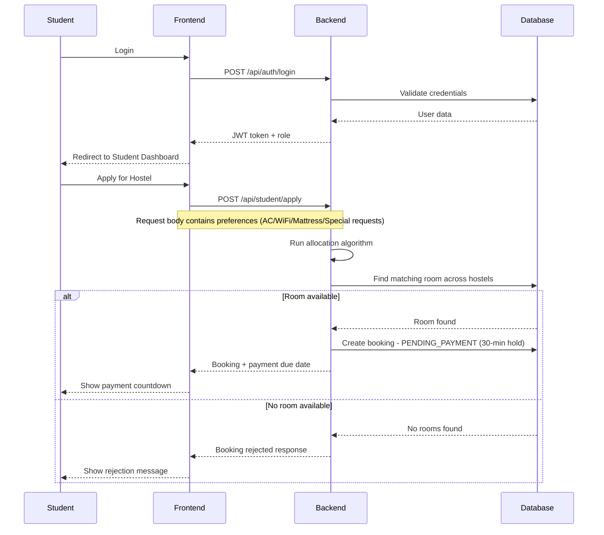

### Admin Management Flow

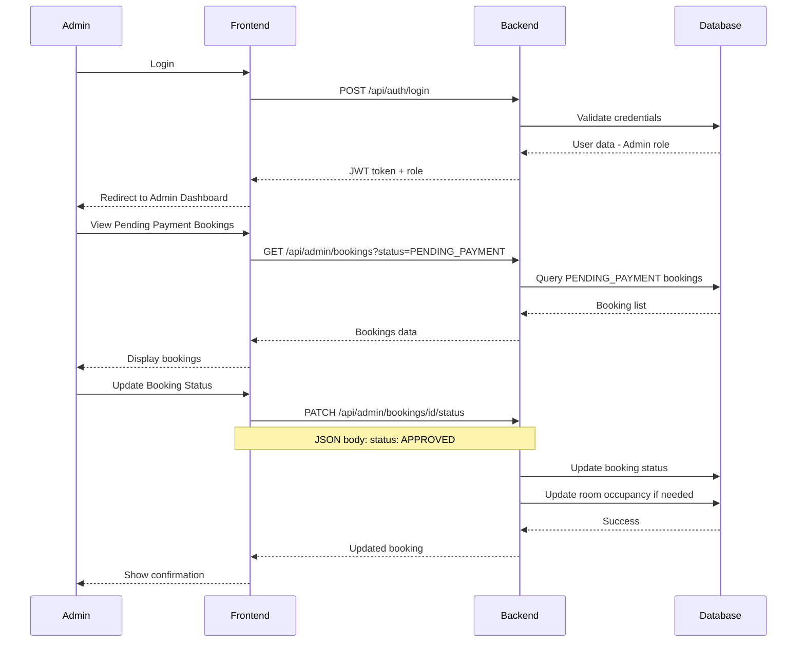

---

## Configuration Files

### application.yml

```yaml
spring:
  application:
    name: hostel-management-system

  datasource:
    url: jdbc:mysql://localhost:3306/hostel_db
    username: root
    password: ${DB_PASSWORD}
    driver-class-name: com.mysql.cj.jdbc.Driver

  jpa:
    hibernate:
      ddl-auto: update
    show-sql: false
    properties:
      hibernate:
        dialect: org.hibernate.dialect.MySQLDialect
        format_sql: true

server:
  port: 8080

jwt:
  secret: ${JWT_SECRET}
  expiration: 86400000

app:
  frontend-url: http://localhost:3000
```

---

## Database Migration Scripts and Seed Data

### MySQL Database Setup

#### Database Creation Script

```sql
-- database/init/01_create_database.sql

CREATE DATABASE IF NOT EXISTS hostel_db
CHARACTER SET utf8mb4
COLLATE utf8mb4_unicode_ci;

USE hostel_db;

-- Create hostels table
CREATE TABLE IF NOT EXISTS hostels (
    id BIGINT AUTO_INCREMENT PRIMARY KEY,
    name VARCHAR(100) NOT NULL,
    location VARCHAR(200),
    total_rooms INT DEFAULT 0,
    gender_type ENUM('MIXED') DEFAULT 'MIXED',
    active BOOLEAN DEFAULT TRUE,
    created_at DATETIME DEFAULT CURRENT_TIMESTAMP,
    updated_at DATETIME DEFAULT CURRENT_TIMESTAMP ON UPDATE CURRENT_TIMESTAMP
);

-- Create rooms table
CREATE TABLE IF NOT EXISTS rooms (
    id BIGINT AUTO_INCREMENT PRIMARY KEY,
    hostel_id BIGINT NOT NULL,
    room_number VARCHAR(20) NOT NULL,
    capacity INT NOT NULL DEFAULT 2,
    current_occupancy INT DEFAULT 0,
    room_gender ENUM('MALE', 'FEMALE') NOT NULL,
    mattress_type ENUM('NORMAL', 'QUEEN') DEFAULT 'NORMAL',
    has_ac BOOLEAN DEFAULT FALSE,
    has_wifi BOOLEAN DEFAULT TRUE,
    status ENUM('AVAILABLE', 'FULL', 'MAINTENANCE') DEFAULT 'AVAILABLE',
    price DECIMAL(10, 2) DEFAULT 0.00,
    floor_number INT,
    version INT DEFAULT 0,
    created_at DATETIME DEFAULT CURRENT_TIMESTAMP,
    updated_at DATETIME DEFAULT CURRENT_TIMESTAMP ON UPDATE CURRENT_TIMESTAMP,
    FOREIGN KEY (hostel_id) REFERENCES hostels(id) ON DELETE CASCADE,
    UNIQUE KEY unique_room (hostel_id, room_number)
);

-- Create students table
CREATE TABLE IF NOT EXISTS students (
    id BIGINT AUTO_INCREMENT PRIMARY KEY,
    full_name VARCHAR(100) NOT NULL,
    email VARCHAR(100) NOT NULL UNIQUE,
    phone VARCHAR(20),
    gender ENUM('MALE', 'FEMALE') NOT NULL,
    password VARCHAR(255) NOT NULL,
    role ENUM('ADMIN', 'STUDENT') DEFAULT 'STUDENT',
    active BOOLEAN DEFAULT TRUE,
    created_at DATETIME DEFAULT CURRENT_TIMESTAMP,
    updated_at DATETIME DEFAULT CURRENT_TIMESTAMP ON UPDATE CURRENT_TIMESTAMP
);

-- Create bookings table
CREATE TABLE IF NOT EXISTS bookings (
    id BIGINT AUTO_INCREMENT PRIMARY KEY,
    student_id BIGINT NOT NULL,
    room_id BIGINT NOT NULL,
    status ENUM('PENDING_PAYMENT', 'APPROVED', 'REJECTED', 'CANCELLED', 'EXPIRED') DEFAULT 'PENDING_PAYMENT',
    booking_date DATETIME DEFAULT CURRENT_TIMESTAMP,
    created_at DATETIME DEFAULT CURRENT_TIMESTAMP,
    updated_at DATETIME DEFAULT CURRENT_TIMESTAMP ON UPDATE CURRENT_TIMESTAMP,
    FOREIGN KEY (student_id) REFERENCES students(id) ON DELETE CASCADE,
    FOREIGN KEY (room_id) REFERENCES rooms(id) ON DELETE CASCADE
);

-- Create payments table
CREATE TABLE IF NOT EXISTS payments (
    id BIGINT AUTO_INCREMENT PRIMARY KEY,
    booking_id BIGINT NOT NULL,
    student_id BIGINT NOT NULL,
    amount DECIMAL(10, 2) NOT NULL,
    payment_method ENUM('MOBILE_MONEY', 'BANK_TRANSFER', 'CASH', 'CARD') NOT NULL,
    transaction_id VARCHAR(100),
    status ENUM('PENDING', 'COMPLETED', 'FAILED', 'REFUNDED') DEFAULT 'PENDING',
    payment_date DATETIME,
    due_date DATETIME NOT NULL,
    created_at DATETIME DEFAULT CURRENT_TIMESTAMP,
    updated_at DATETIME DEFAULT CURRENT_TIMESTAMP ON UPDATE CURRENT_TIMESTAMP,
    FOREIGN KEY (booking_id) REFERENCES bookings(id) ON DELETE CASCADE,
    FOREIGN KEY (student_id) REFERENCES students(id) ON DELETE CASCADE
);

-- Create indexes for performance
CREATE INDEX idx_rooms_hostel ON rooms(hostel_id);
CREATE INDEX idx_rooms_gender ON rooms(room_gender);
CREATE INDEX idx_rooms_status ON rooms(status);
CREATE INDEX idx_bookings_student ON bookings(student_id);
CREATE INDEX idx_bookings_student_status ON bookings(student_id, status);
CREATE INDEX idx_bookings_status ON bookings(status);
CREATE INDEX idx_payments_status ON payments(status);
```

#### Seed Data Script

```sql
-- database/init/02_seed_data.sql

USE hostel_db;

-- Insert Admin User
INSERT INTO students (full_name, email, phone, gender, password, role) VALUES
('System Admin', 'admin@university.edu', '+1234567890', 'MALE', 
 '$2a$10$encrypted_password_here', 'ADMIN');

-- Insert Sample Students
INSERT INTO students (full_name, email, phone, gender, password, role) VALUES
('John Doe', 'john.doe@university.edu', '+1234567891', 'MALE', 
 '$2a$10$encrypted_password_here', 'STUDENT'),
('Jane Smith', 'jane.smith@university.edu', '+1234567892', 'FEMALE', 
 '$2a$10$encrypted_password_here', 'STUDENT'),
('Michael Johnson', 'michael.j@university.edu', '+1234567893', 'MALE', 
 '$2a$10$encrypted_password_here', 'STUDENT'),
('Sarah Williams', 'sarah.w@university.edu', '+1234567894', 'FEMALE', 
 '$2a$10$encrypted_password_here', 'STUDENT'),
('David Brown', 'david.b@university.edu', '+1234567895', 'MALE', 
 '$2a$10$encrypted_password_here', 'STUDENT');

-- Insert Hostels
INSERT INTO hostels (name, location, total_rooms, gender_type) VALUES
('Hostel Alpha', 'North Campus, Block A', 50, 'MIXED'),
('Hostel Beta', 'South Campus, Block B', 60, 'MIXED'),
('Hostel Gamma', 'East Campus, Block C', 40, 'MIXED'),
('Hostel Delta', 'West Campus, Block D', 55, 'MIXED');

-- Insert Rooms for Hostel Alpha (ID: 1)
-- Male Rooms - Floor 1
INSERT INTO rooms (hostel_id, room_number, capacity, current_occupancy, room_gender, mattress_type, has_ac, has_wifi, status, price, floor_number) VALUES
(1, 'A101', 2, 0, 'MALE', 'NORMAL', TRUE, TRUE, 'AVAILABLE', 500.00, 1),
(1, 'A102', 2, 0, 'MALE', 'NORMAL', TRUE, TRUE, 'AVAILABLE', 500.00, 1),
(1, 'A103', 2, 0, 'MALE', 'QUEEN', TRUE, TRUE, 'AVAILABLE', 600.00, 1),
(1, 'A104', 3, 0, 'MALE', 'NORMAL', FALSE, TRUE, 'AVAILABLE', 400.00, 1),
(1, 'A105', 3, 0, 'MALE', 'NORMAL', FALSE, TRUE, 'AVAILABLE', 400.00, 1);

-- Male Rooms - Floor 2
INSERT INTO rooms (hostel_id, room_number, capacity, current_occupancy, room_gender, mattress_type, has_ac, has_wifi, status, price, floor_number) VALUES
(1, 'A201', 2, 0, 'MALE', 'NORMAL', TRUE, TRUE, 'AVAILABLE', 500.00, 2),
(1, 'A202', 2, 0, 'MALE', 'QUEEN', TRUE, TRUE, 'AVAILABLE', 600.00, 2),
(1, 'A203', 3, 0, 'MALE', 'NORMAL', FALSE, TRUE, 'AVAILABLE', 400.00, 2),
(1, 'A204', 2, 0, 'MALE', 'NORMAL', TRUE, FALSE, 'AVAILABLE', 450.00, 2),
(1, 'A205', 2, 0, 'MALE', 'NORMAL', TRUE, TRUE, 'AVAILABLE', 500.00, 2);

-- Female Rooms - Floor 3
INSERT INTO rooms (hostel_id, room_number, capacity, current_occupancy, room_gender, mattress_type, has_ac, has_wifi, status, price, floor_number) VALUES
(1, 'A301', 2, 0, 'FEMALE', 'NORMAL', TRUE, TRUE, 'AVAILABLE', 500.00, 3),
(1, 'A302', 2, 0, 'FEMALE', 'QUEEN', TRUE, TRUE, 'AVAILABLE', 600.00, 3),
(1, 'A303', 2, 0, 'FEMALE', 'NORMAL', TRUE, TRUE, 'AVAILABLE', 500.00, 3),
(1, 'A304', 3, 0, 'FEMALE', 'NORMAL', FALSE, TRUE, 'AVAILABLE', 400.00, 3),
(1, 'A305', 2, 0, 'FEMALE', 'NORMAL', TRUE, TRUE, 'AVAILABLE', 500.00, 3);

-- Insert Rooms for Hostel Beta (ID: 2)
-- Male Rooms
INSERT INTO rooms (hostel_id, room_number, capacity, current_occupancy, room_gender, mattress_type, has_ac, has_wifi, status, price, floor_number) VALUES
(2, 'B101', 2, 0, 'MALE', 'NORMAL', TRUE, TRUE, 'AVAILABLE', 550.00, 1),
(2, 'B102', 2, 0, 'MALE', 'NORMAL', TRUE, TRUE, 'AVAILABLE', 550.00, 1),
(2, 'B103', 3, 0, 'MALE', 'QUEEN', TRUE, TRUE, 'AVAILABLE', 650.00, 1),
(2, 'B104', 2, 0, 'MALE', 'NORMAL', FALSE, TRUE, 'AVAILABLE', 450.00, 1),
(2, 'B105', 2, 0, 'MALE', 'NORMAL', TRUE, TRUE, 'AVAILABLE', 550.00, 1);

-- Female Rooms
INSERT INTO rooms (hostel_id, room_number, capacity, current_occupancy, room_gender, mattress_type, has_ac, has_wifi, status, price, floor_number) VALUES
(2, 'B201', 2, 0, 'FEMALE', 'NORMAL', TRUE, TRUE, 'AVAILABLE', 550.00, 2),
(2, 'B202', 2, 0, 'FEMALE', 'QUEEN', TRUE, TRUE, 'AVAILABLE', 650.00, 2),
(2, 'B203', 2, 0, 'FEMALE', 'NORMAL', TRUE, TRUE, 'AVAILABLE', 550.00, 2),
(2, 'B204', 3, 0, 'FEMALE', 'NORMAL', FALSE, TRUE, 'AVAILABLE', 450.00, 2),
(2, 'B205', 2, 0, 'FEMALE', 'NORMAL', TRUE, TRUE, 'AVAILABLE', 550.00, 2);

-- Insert Rooms for Hostel Gamma (ID: 3)
INSERT INTO rooms (hostel_id, room_number, capacity, current_occupancy, room_gender, mattress_type, has_ac, has_wifi, status, price, floor_number) VALUES
(3, 'C101', 2, 0, 'MALE', 'NORMAL', TRUE, TRUE, 'AVAILABLE', 480.00, 1),
(3, 'C102', 2, 0, 'MALE', 'NORMAL', TRUE, TRUE, 'AVAILABLE', 480.00, 1),
(3, 'C103', 2, 0, 'FEMALE', 'NORMAL', TRUE, TRUE, 'AVAILABLE', 480.00, 1),
(3, 'C104', 2, 0, 'FEMALE', 'QUEEN', TRUE, TRUE, 'AVAILABLE', 580.00, 1),
(3, 'C105', 3, 0, 'MALE', 'NORMAL', FALSE, TRUE, 'AVAILABLE', 380.00, 1);

-- Insert Rooms for Hostel Delta (ID: 4)
INSERT INTO rooms (hostel_id, room_number, capacity, current_occupancy, room_gender, mattress_type, has_ac, has_wifi, status, price, floor_number) VALUES
(4, 'D101', 2, 0, 'MALE', 'NORMAL', TRUE, TRUE, 'AVAILABLE', 520.00, 1),
(4, 'D102', 2, 0, 'MALE', 'QUEEN', TRUE, TRUE, 'AVAILABLE', 620.00, 1),
(4, 'D103', 2, 0, 'FEMALE', 'NORMAL', TRUE, TRUE, 'AVAILABLE', 520.00, 1),
(4, 'D104', 2, 0, 'FEMALE', 'NORMAL', TRUE, TRUE, 'AVAILABLE', 520.00, 1),
(4, 'D105', 3, 0, 'FEMALE', 'NORMAL', FALSE, TRUE, 'AVAILABLE', 420.00, 1);

-- Update hostel total rooms counts
UPDATE hostels h SET total_rooms = (SELECT COUNT(*) FROM rooms r WHERE r.hostel_id = h.id);
```

---

## Docker Integration

### Docker Architecture

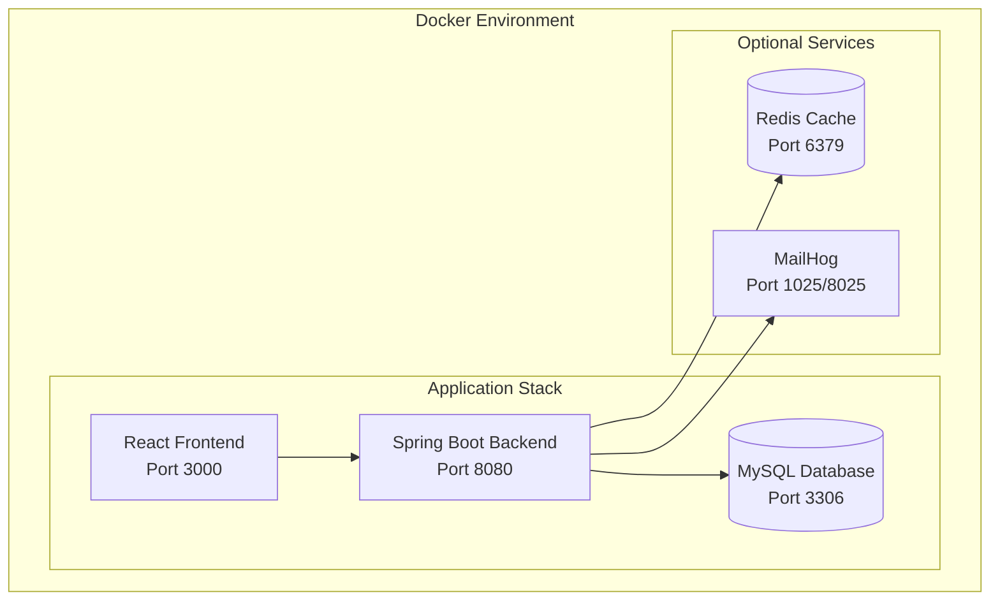

### Project Structure with Docker

```
hostel-management-system/
├── backend/
│   ├── src/
│   ├── pom.xml
│   ├── Dockerfile
│   └── wait-for-it.sh
│
├── frontend/
│   ├── src/
│   ├── package.json
│   ├── Dockerfile
│   └── nginx.conf
│
├── database/
│   └── init/
│       ├── 01_create_database.sql
│       └── 02_seed_data.sql
│
├── docker-compose.yml
├── docker-compose.dev.yml
├── docker-compose.prod.yml
└── .env.example
```

### Docker Compose Configuration

#### Main Docker Compose File

```yaml
# docker-compose.yml
version: '3.8'

services:
  # MySQL Database
  mysql:
    image: mysql:8.0
    container_name: hostel-mysql
    restart: unless-stopped
    environment:
      MYSQL_ROOT_PASSWORD: ${DB_ROOT_PASSWORD:-rootpassword}
      MYSQL_DATABASE: hostel_db
      MYSQL_USER: ${DB_USER:-hostel_user}
      MYSQL_PASSWORD: ${DB_PASSWORD:-hostel_password}
    ports:
      - "3306:3306"
    volumes:
      - mysql_data:/var/lib/mysql
      - ./database/init:/docker-entrypoint-initdb.d
    networks:
      - hostel-network
    healthcheck:
      test: ["CMD", "mysqladmin", "ping", "-h", "localhost"]
      interval: 10s
      timeout: 5s
      retries: 5

  # Spring Boot Backend
  backend:
    build:
      context: ./backend
      dockerfile: Dockerfile
    container_name: hostel-backend
    restart: unless-stopped
    environment:
      SPRING_DATASOURCE_URL: jdbc:mysql://mysql:3306/hostel_db
      SPRING_DATASOURCE_USERNAME: ${DB_USER:-hostel_user}
      SPRING_DATASOURCE_PASSWORD: ${DB_PASSWORD:-hostel_password}
      JWT_SECRET: ${JWT_SECRET:-your-secret-key-change-in-production}
      MAIL_USERNAME: ${MAIL_USERNAME:-}
      MAIL_PASSWORD: ${MAIL_PASSWORD:-}
    ports:
      - "8080:8080"
    depends_on:
      mysql:
        condition: service_healthy
    networks:
      - hostel-network
    volumes:
      - backend_logs:/app/logs

  # React Frontend
  frontend:
    build:
      context: ./frontend
      dockerfile: Dockerfile
    container_name: hostel-frontend
    restart: unless-stopped
    ports:
      - "3000:80"
    depends_on:
      - backend
    networks:
      - hostel-network

  # Redis Cache (Optional)
  redis:
    image: redis:7-alpine
    container_name: hostel-redis
    restart: unless-stopped
    ports:
      - "6379:6379"
    networks:
      - hostel-network
    volumes:
      - redis_data:/data

  # MailHog for Email Testing (Optional)
  mailhog:
    image: mailhog/mailhog
    container_name: hostel-mailhog
    restart: unless-stopped
    ports:
      - "1025:1025"  # SMTP
      - "8025:8025"  # Web UI
    networks:
      - hostel-network

networks:
  hostel-network:
    driver: bridge

volumes:
  mysql_data:
  backend_logs:
  redis_data:
```

#### Development Docker Compose

```yaml
# docker-compose.dev.yml
version: '3.8'

services:
  mysql:
    extends:
      file: docker-compose.yml
      service: mysql
    ports:
      - "3306:3306"

  backend:
    extends:
      file: docker-compose.yml
      service: backend
    environment:
      SPRING_PROFILES_ACTIVE: dev
      SPRING_JPA_SHOW_SQL: "true"
    volumes:
      - ./backend/src:/app/src
    ports:
      - "8080:8080"

  frontend:
    extends:
      file: docker-compose.yml
      service: frontend
    environment:
      REACT_APP_API_URL: http://localhost:8080
    ports:
      - "3000:80"

  mailhog:
    extends:
      file: docker-compose.yml
      service: mailhog
```

#### Production Docker Compose

```yaml
# docker-compose.prod.yml
version: '3.8'

services:
  mysql:
    extends:
      file: docker-compose.yml
      service: mysql
    environment:
      MYSQL_ROOT_PASSWORD: ${DB_ROOT_PASSWORD}
      MYSQL_PASSWORD: ${DB_PASSWORD}
    # No external ports in production
    ports: []

  backend:
    extends:
      file: docker-compose.yml
      service: backend
    environment:
      SPRING_PROFILES_ACTIVE: prod
      SPRING_JPA_SHOW_SQL: "false"
    ports:
      - "8080:8080"
    deploy:
      resources:
        limits:
          cpus: '2'
          memory: 1G
        reservations:
          cpus: '1'
          memory: 512M

  frontend:
    extends:
      file: docker-compose.yml
      service: frontend
    ports:
      - "80:80"
      - "443:443"
    volumes:
      - ./ssl:/etc/nginx/ssl:ro

  redis:
    extends:
      file: docker-compose.yml
      service: redis
```

### Backend Dockerfile

```dockerfile
# backend/Dockerfile

# Build stage
FROM maven:3.9-eclipse-temurin-17 AS build
WORKDIR /app
COPY pom.xml .
RUN mvn dependency:go-offline -B
COPY src ./src
RUN mvn clean package -DskipTests

# Run stage
FROM eclipse-temurin:17-jre-alpine
WORKDIR /app

# Add non-root user
RUN addgroup -S spring && adduser -S spring -G spring
USER spring:spring

# Copy JAR from build stage
COPY --from=build /app/target/*.jar app.jar

# Copy wait script
COPY wait-for-it.sh .
RUN chmod +x wait-for-it.sh

# Health check
HEALTHCHECK --interval=30s --timeout=3s --start-period=60s --retries=3 \
  CMD wget --no-verbose --tries=1 --spider http://localhost:8080/actuator/health || exit 1

EXPOSE 8080
ENTRYPOINT ["java", "-jar", "app.jar"]
```

### Frontend Dockerfile

```dockerfile
# frontend/Dockerfile

# Build stage
FROM node:18-alpine AS build
WORKDIR /app
COPY package*.json ./
RUN npm ci
COPY . .
RUN npm run build

# Production stage with Nginx
FROM nginx:alpine
COPY --from=build /app/build /usr/share/nginx/html
COPY nginx.conf /etc/nginx/nginx.conf

# Health check
HEALTHCHECK --interval=30s --timeout=3s --start-period=10s --retries=3 \
  CMD wget --no-verbose --tries=1 --spider http://localhost/ || exit 1

EXPOSE 80
CMD ["nginx", "-g", "daemon off;"]
```

### Nginx Configuration

```nginx
# frontend/nginx.conf

events {
    worker_connections 1024;
}

http {
    include /etc/nginx/mime.types;
    default_type application/octet-stream;

    # Gzip compression
    gzip on;
    gzip_vary on;
    gzip_min_length 1024;
    gzip_types text/plain text/css text/xml text/javascript application/javascript application/json application/xml;

    # Security headers
    add_header X-Frame-Options "SAMEORIGIN" always;
    add_header X-Content-Type-Options "nosniff" always;
    add_header X-XSS-Protection "1; mode=block" always;

    upstream backend {
        server backend:8080;
    }

    server {
        listen 80;
        server_name localhost;
        root /usr/share/nginx/html;
        index index.html;

        # Frontend routes - serve index.html
        location / {
            try_files $uri $uri/ /index.html;
        }

        # API proxy to backend
        location /api/ {
            proxy_pass http://backend;
            proxy_set_header Host $host;
            proxy_set_header X-Real-IP $remote_addr;
            proxy_set_header X-Forwarded-For $proxy_add_x_forwarded_for;
            proxy_set_header X-Forwarded-Proto $scheme;
        }

        # Static files caching
        location ~* \.(js|css|png|jpg|jpeg|gif|ico|svg|woff|woff2)$ {
            expires 1y;
            add_header Cache-Control "public, immutable";
        }
    }
}
```

### Environment Variables

```bash
# .env.example

# Database Configuration
DB_ROOT_PASSWORD=rootpassword
DB_USER=hostel_user
DB_PASSWORD=hostel_password

# JWT Configuration
JWT_SECRET=your-super-secret-jwt-key-change-in-production-min-256-bits

# Email Configuration
MAIL_USERNAME=your-email@gmail.com
MAIL_PASSWORD=your-app-password

# Application URLs
FRONTEND_URL=http://localhost:3000
BACKEND_URL=http://localhost:8080
```

### Docker Commands

```bash
# Start all services
docker-compose up -d

# Start with development configuration
docker-compose -f docker-compose.yml -f docker-compose.dev.yml up -d

# Start with production configuration
docker-compose -f docker-compose.yml -f docker-compose.prod.yml up -d

# View logs
docker-compose logs -f backend
docker-compose logs -f frontend

# Stop all services
docker-compose down

# Stop and remove volumes
docker-compose down -v

# Rebuild containers
docker-compose build --no-cache
docker-compose up -d

# Scale backend (production)
docker-compose -f docker-compose.yml -f docker-compose.prod.yml up -d --scale backend=3

# Check container status
docker-compose ps

# Execute command in container
docker-compose exec backend bash
docker-compose exec mysql mysql -u root -p
```

### Application Configuration for Docker

```yaml
# backend/src/main/resources/application-docker.yml
spring:
  datasource:
    url: jdbc:mysql://mysql:3306/hostel_db
    username: ${SPRING_DATASOURCE_USERNAME:hostel_user}
    password: ${SPRING_DATASOURCE_PASSWORD:hostel_password}
    driver-class-name: com.mysql.cj.jdbc.Driver

  jpa:
    hibernate:
      ddl-auto: validate
    show-sql: false

  mail:
    host: mailhog
    port: 1025
    username: ${MAIL_USERNAME:}
    password: ${MAIL_PASSWORD:}

server:
  port: 8080

jwt:
  secret: ${JWT_SECRET:default-secret-key}
  expiration: 86400000

logging:
  level:
    root: INFO
    com.hostelmanagement: DEBUG
```

---

## CI/CD Pipeline with GitHub Actions

### Pipeline Overview

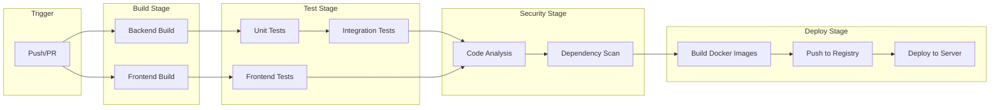

### Project Structure for CI/CD

```
hostel-management-system/
├── .github/
│   └── workflows/
│       ├── backend-ci.yml
│       ├── frontend-ci.yml
│       ├── security-scan.yml
│       └── deploy.yml
├── backend/
├── frontend/
├── docker-compose.yml
└── README.md
```

### Backend CI Workflow

```yaml
# .github/workflows/backend-ci.yml
name: Backend CI

on:
  push:
    branches: [ main, develop ]
    paths:
      - 'backend/**'
  pull_request:
    branches: [ main, develop ]
    paths:
      - 'backend/**'

env:
  JAVA_VERSION: '17'
  MAVEN_VERSION: '3.9'

jobs:
  build:
    runs-on: ubuntu-latest
    defaults:
      run:
        working-directory: backend
  
    steps:
      - name: Checkout code
        uses: actions/checkout@v4

      - name: Set up JDK 17
        uses: actions/setup-java@v4
        with:
          java-version: ${{ env.JAVA_VERSION }}
          distribution: 'temurin'
          cache: maven

      - name: Build with Maven
        run: mvn clean compile -DskipTests

      - name: Run unit tests
        run: mvn test

      - name: Run integration tests
        run: mvn verify -DskipUnitTests

      - name: Generate test coverage report
        run: mvn jacoco:report

      - name: Upload coverage to Codecov
        uses: codecov/codecov-action@v3
        with:
          files: ./backend/target/site/jacoco/jacoco.xml
          flags: backend
          fail_ci_if_error: false

      - name: Cache Maven packages
        uses: actions/cache@v3
        with:
          path: ~/.m2
          key: ${{ runner.os }}-m2-${{ hashFiles('**/pom.xml') }}
          restore-keys: |
            ${{ runner.os }}-m2-

  code-quality:
    runs-on: ubuntu-latest
    needs: build
    defaults:
      run:
        working-directory: backend
  
    steps:
      - name: Checkout code
        uses: actions/checkout@v4

      - name: Set up JDK 17
        uses: actions/setup-java@v4
        with:
          java-version: ${{ env.JAVA_VERSION }}
          distribution: 'temurin'
          cache: maven

      - name: Run SonarCloud Scan
        uses: SonarSource/sonarcloud-github-action@master
        env:
          GITHUB_TOKEN: ${{ secrets.GITHUB_TOKEN }}
          SONAR_TOKEN: ${{ secrets.SONAR_TOKEN }}
        with:
          projectBaseDir: backend

  build-docker:
    runs-on: ubuntu-latest
    needs: [build, code-quality]
    if: github.ref == 'refs/heads/main'
  
    steps:
      - name: Checkout code
        uses: actions/checkout@v4

      - name: Set up Docker Buildx
        uses: docker/setup-buildx-action@v3

      - name: Login to Docker Hub
        uses: docker/login-action@v3
        with:
          username: ${{ secrets.DOCKER_USERNAME }}
          password: ${{ secrets.DOCKER_PASSWORD }}

      - name: Build and push Backend image
        uses: docker/build-push-action@v5
        with:
          context: ./backend
          push: true
          tags: |
            ${{ secrets.DOCKER_USERNAME }}/hostel-backend:latest
            ${{ secrets.DOCKER_USERNAME }}/hostel-backend:${{ github.sha }}
          cache-from: type=gha
          cache-to: type=gha,mode=max
```

### Frontend CI Workflow

```yaml
# .github/workflows/frontend-ci.yml
name: Frontend CI

on:
  push:
    branches: [ main, develop ]
    paths:
      - 'frontend/**'
  pull_request:
    branches: [ main, develop ]
    paths:
      - 'frontend/**'

env:
  NODE_VERSION: '18'

jobs:
  build-and-test:
    runs-on: ubuntu-latest
    defaults:
      run:
        working-directory: frontend
  
    steps:
      - name: Checkout code
        uses: actions/checkout@v4

      - name: Set up Node.js
        uses: actions/setup-node@v4
        with:
          node-version: ${{ env.NODE_VERSION }}
          cache: 'npm'
          cache-dependency-path: frontend/package-lock.json

      - name: Install dependencies
        run: npm ci

      - name: Run linter
        run: npm run lint

      - name: Run tests
        run: npm test -- --coverage --watchAll=false

      - name: Build application
        run: npm run build

      - name: Upload coverage to Codecov
        uses: codecov/codecov-action@v3
        with:
          files: ./frontend/coverage/lcov.info
          flags: frontend
          fail_ci_if_error: false

      - name: Cache node modules
        uses: actions/cache@v3
        with:
          path: frontend/node_modules
          key: ${{ runner.os }}-node-${{ hashFiles('frontend/package-lock.json') }}
          restore-keys: |
            ${{ runner.os }}-node-

  build-docker:
    runs-on: ubuntu-latest
    needs: build-and-test
    if: github.ref == 'refs/heads/main'
  
    steps:
      - name: Checkout code
        uses: actions/checkout@v4

      - name: Set up Docker Buildx
        uses: docker/setup-buildx-action@v3

      - name: Login to Docker Hub
        uses: docker/login-action@v3
        with:
          username: ${{ secrets.DOCKER_USERNAME }}
          password: ${{ secrets.DOCKER_PASSWORD }}

      - name: Build and push Frontend image
        uses: docker/build-push-action@v5
        with:
          context: ./frontend
          push: true
          tags: |
            ${{ secrets.DOCKER_USERNAME }}/hostel-frontend:latest
            ${{ secrets.DOCKER_USERNAME }}/hostel-frontend:${{ github.sha }}
          cache-from: type=gha
          cache-to: type=gha,mode=max
```

### Security Scan Workflow

```yaml
# .github/workflows/security-scan.yml
name: Security Scan

on:
  push:
    branches: [ main, develop ]
  pull_request:
    branches: [ main, develop ]
  schedule:
    - cron: '0 0 * * 0'  # Weekly scan

jobs:
  dependency-scan:
    runs-on: ubuntu-latest
  
    steps:
      - name: Checkout code
        uses: actions/checkout@v4

      - name: Run Trivy vulnerability scanner
        uses: aquasecurity/trivy-action@master
        with:
          scan-type: 'fs'
          scan-ref: '.'
          format: 'table'
          exit-code: '1'
          ignore-unfixed: true
          severity: 'CRITICAL,HIGH'

      - name: Run Snyk security scan
        uses: snyk/actions/node@master
        env:
          SNYK_TOKEN: ${{ secrets.SNYK_TOKEN }}
        with:
          args: --all-projects --severity-threshold=high

  codeql-analysis:
    runs-on: ubuntu-latest
    permissions:
      actions: read
      contents: read
      security-events: write

    strategy:
      fail-fast: false
      matrix:
        language: [ 'java', 'javascript' ]

    steps:
      - name: Checkout code
        uses: actions/checkout@v4

      - name: Initialize CodeQL
        uses: github/codeql-action/init@v2
        with:
          languages: ${{ matrix.language }}

      - name: Autobuild
        uses: github/codeql-action/autobuild@v2

      - name: Perform CodeQL Analysis
        uses: github/codeql-action/analyze@v2
        with:
          category: "/language:${{ matrix.language }}"
```

### Deployment Workflow

```yaml
# .github/workflows/deploy.yml
name: Deploy to Production

on:
  push:
    branches: [ main ]
  workflow_dispatch:
    inputs:
      environment:
        description: 'Environment to deploy to'
        required: true
        default: 'staging'
        type: choice
        options:
          - staging
          - production

env:
  REGISTRY: ${{ secrets.DOCKER_USERNAME }}
  BACKEND_IMAGE: hostel-backend
  FRONTEND_IMAGE: hostel-frontend

jobs:
  deploy:
    runs-on: ubuntu-latest
    environment: ${{ github.event.inputs.environment || 'staging' }}
  
    steps:
      - name: Checkout code
        uses: actions/checkout@v4

      - name: Deploy to server via SSH
        uses: appleboy/ssh-action@master
        with:
          host: ${{ secrets.SERVER_HOST }}
          username: ${{ secrets.SERVER_USER }}
          key: ${{ secrets.SSH_PRIVATE_KEY }}
          script: |
            cd /opt/hostel-management
          
            # Pull latest images
            docker-compose pull
          
            # Stop existing containers
            docker-compose down
          
            # Start new containers
            docker-compose up -d
          
            # Clean up old images
            docker image prune -f
          
            # Check health
            sleep 30
            curl -f http://localhost:8080/actuator/health || exit 1

      - name: Send deployment notification
        uses: 8398a7/action-slack@v3
        with:
          status: ${{ job.status }}
          text: |
            Deployment to ${{ github.event.inputs.environment || 'staging' }}
            Commit: ${{ github.sha }}
            Author: ${{ github.actor }}
          webhook_url: ${{ secrets.SLACK_WEBHOOK }}
        if: always()

  rollback:
    runs-on: ubuntu-latest
    needs: deploy
    if: failure()
  
    steps:
      - name: Rollback to previous version
        uses: appleboy/ssh-action@master
        with:
          host: ${{ secrets.SERVER_HOST }}
          username: ${{ secrets.SERVER_USER }}
          key: ${{ secrets.SSH_PRIVATE_KEY }}
          script: |
            cd /opt/hostel-management
          
            # Rollback to previous image
            docker-compose down
            docker-compose up -d --build
          
            # Notify team
            echo "Rollback completed for ${{ github.sha }}"
```

### Required GitHub Secrets

| Secret              | Description                        |
| ------------------- | ---------------------------------- |
| `DOCKER_USERNAME` | Docker Hub username                |
| `DOCKER_PASSWORD` | Docker Hub password/token          |
| `SERVER_HOST`     | Production server IP/hostname      |
| `SERVER_USER`     | SSH user for deployment            |
| `SSH_PRIVATE_KEY` | SSH private key for server access  |
| `SONAR_TOKEN`     | SonarCloud token for code analysis |
| `SNYK_TOKEN`      | Snyk token for security scanning   |
| `SLACK_WEBHOOK`   | Slack webhook for notifications    |

### Branch Protection Rules

```yaml
# Recommended branch protection settings for main branch

branches:
  - name: main
    protection:
      required_pull_request_reviews:
        dismiss_stale_reviews: true
        require_code_owner_reviews: true
        required_approving_review_count: 2
      required_status_checks:
        strict: true
        contexts:
          - Backend CI / build
          - Backend CI / code-quality
          - Frontend CI / build-and-test
          - Security Scan / dependency-scan
          - Security Scan / codeql-analysis (java)
          - Security Scan / codeql-analysis (javascript)
      enforce_admins: true
      restrictions:
        users: []
        teams: ['admin-team']
```

### CI/CD Pipeline Summary

| Stage    | Trigger          | Actions                     |
| -------- | ---------------- | --------------------------- |
| Build    | Push/PR          | Compile, Lint, Unit Tests   |
| Test     | After Build      | Integration Tests, Coverage |
| Security | Push/PR/Schedule | Dependency Scan, CodeQL     |
| Quality  | After Test       | SonarCloud Analysis         |
| Docker   | Main Branch      | Build & Push Images         |
| Deploy   | Main Branch      | SSH Deploy, Health Check    |
| Rollback | Deploy Failure   | Automatic Rollback          |

---

## Cloud Deployment Options

### Deployment Architecture Overview

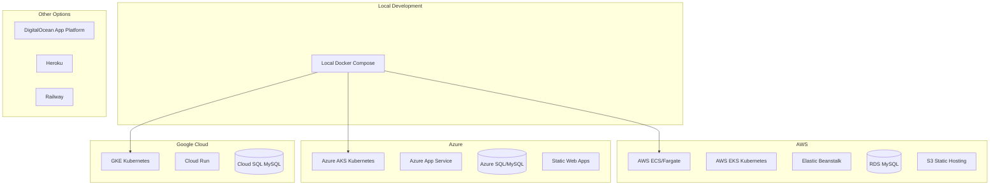

---

### AWS Deployment

#### Option 1: AWS ECS with Fargate (Recommended)

**Architecture:**

```
Route 53 (DNS)
    |
CloudFront (CDN)
    |
Application Load Balancer
    |
    +-- ECS Frontend Service (React)
    +-- ECS Backend Service (Spring Boot)
    |
RDS MySQL (Multi-AZ)
    |
ElastiCache Redis (Optional)
```

**Task Definitions:**

```json
// backend-task-definition.json
{
  "family": "hostel-backend",
  "networkMode": "awsvpc",
  "requiresCompatibilities": ["FARGATE"],
  "cpu": "1024",
  "memory": "2048",
  "containerDefinitions": [
    {
      "name": "backend",
      "image": "${AWS_ACCOUNT}.dkr.ecr.${REGION}.amazonaws.com/hostel-backend:latest",
      "essential": true,
      "portMappings": [
        {
          "containerPort": 8080,
          "protocol": "tcp"
        }
      ],
      "environment": [
        { "name": "SPRING_PROFILES_ACTIVE", "value": "prod" }
      ],
      "secrets": [
        { "name": "DB_PASSWORD", "valueFrom": "arn:aws:secretsmanager:region:account:secret:hostel/db-password" },
        { "name": "JWT_SECRET", "valueFrom": "arn:aws:secretsmanager:region:account:secret:hostel/jwt-secret" }
      ],
      "logConfiguration": {
        "logDriver": "awslogs",
        "options": {
          "awslogs-group": "/ecs/hostel-backend",
          "awslogs-region": "us-east-1",
          "awslogs-stream-prefix": "ecs"
        }
      }
    }
  ]
}
```

**GitHub Actions AWS Deploy:**

```yaml
# .github/workflows/deploy-aws.yml
name: Deploy to AWS ECS

on:
  push:
    branches: [ main ]

env:
  AWS_REGION: us-east-1
  ECR_REPOSITORY_BACKEND: hostel-backend
  ECR_REPOSITORY_FRONTEND: hostel-frontend
  ECS_SERVICE: hostel-service
  ECS_CLUSTER: hostel-cluster
  ECS_TASK_DEFINITION: backend-task-definition.json

jobs:
  deploy:
    runs-on: ubuntu-latest
  
    steps:
      - name: Checkout code
        uses: actions/checkout@v4

      - name: Configure AWS credentials
        uses: aws-actions/configure-aws-credentials@v4
        with:
          aws-access-key-id: ${{ secrets.AWS_ACCESS_KEY_ID }}
          aws-secret-access-key: ${{ secrets.AWS_SECRET_ACCESS_KEY }}
          aws-region: ${{ env.AWS_REGION }}

      - name: Login to Amazon ECR
        id: login-ecr
        uses: aws-actions/amazon-ecr-login@v2

      - name: Build, tag, and push backend image
        env:
          ECR_REGISTRY: ${{ steps.login-ecr.outputs.registry }}
          IMAGE_TAG: ${{ github.sha }}
        run: |
          docker build -t $ECR_REGISTRY/$ECR_REPOSITORY_BACKEND:$IMAGE_TAG ./backend
          docker push $ECR_REGISTRY/$ECR_REPOSITORY_BACKEND:$IMAGE_TAG

      - name: Build, tag, and push frontend image
        env:
          ECR_REGISTRY: ${{ steps.login-ecr.outputs.registry }}
          IMAGE_TAG: ${{ github.sha }}
        run: |
          docker build -t $ECR_REGISTRY/$ECR_REPOSITORY_FRONTEND:$IMAGE_TAG ./frontend
          docker push $ECR_REGISTRY/$ECR_REPOSITORY_FRONTEND:$IMAGE_TAG

      - name: Fill in the new image ID
        id: task-def
        uses: aws-actions/amazon-ecs-render-task-definition@v1
        with:
          task-definition: ${{ env.ECS_TASK_DEFINITION }}
          container-name: backend
          image: ${{ steps.login-ecr.outputs.registry }}/${{ env.ECR_REPOSITORY_BACKEND }}:${{ github.sha }}

      - name: Deploy Amazon ECS task definition
        uses: aws-actions/amazon-ecs-deploy-task-definition@v1
        with:
          task-definition: ${{ steps.task-def.outputs.task-definition }}
          service: ${{ env.ECS_SERVICE }}
          cluster: ${{ env.ECS_CLUSTER }}
          wait-for-service-stability: true
```

#### Option 2: AWS Elastic Beanstalk

```yaml
# .github/workflows/deploy-beanstalk.yml
name: Deploy to Elastic Beanstalk

on:
  push:
    branches: [ main ]

jobs:
  deploy:
    runs-on: ubuntu-latest
  
    steps:
      - name: Checkout code
        uses: actions/checkout@v4

      - name: Generate deployment package
        run: |
          mkdir -p deploy
          cp docker-compose.yml deploy/
          cp -r backend deploy/
          cp -r frontend deploy/
          cp .env.example deploy/.env
          cd deploy && zip -r ../deploy.zip .

      - name: Deploy to Elastic Beanstalk
        uses: einaregilsson/beanstalk-deploy@v21
        with:
          aws_access_key: ${{ secrets.AWS_ACCESS_KEY_ID }}
          aws_secret_key: ${{ secrets.AWS_SECRET_ACCESS_KEY }}
          application_name: hostel-management
          environment_name: hostel-production
          version_label: ${{ github.sha }}
          region: us-east-1
          deployment_package: deploy.zip
```

#### AWS Infrastructure with Terraform

```hcl
# infrastructure/aws/main.tf

provider "aws" {
  region = var.aws_region
}

# VPC
module "vpc" {
  source  = "terraform-aws-modules/vpc/aws"
  version = "5.0.0"

  name = "hostel-vpc"
  cidr = "10.0.0.0/16"

  azs             = ["${var.aws_region}a", "${var.aws_region}b", "${var.aws_region}c"]
  private_subnets = ["10.0.1.0/24", "10.0.2.0/24", "10.0.3.0/24"]
  public_subnets  = ["10.0.101.0/24", "10.0.102.0/24", "10.0.103.0/24"]

  enable_nat_gateway = true
  single_nat_gateway = true
}

# RDS MySQL
resource "aws_db_instance" "hostel_db" {
  identifier           = "hostel-db"
  engine               = "mysql"
  engine_version       = "8.0"
  instance_class       = "db.t3.medium"
  allocated_storage    = 20
  storage_encrypted    = true
  
  db_name  = "hostel_db"
  username = var.db_username
  password = var.db_password

  vpc_security_group_ids = [aws_security_group.rds.id]
  db_subnet_group_name   = aws_db_subnet_group.hostel.name

  backup_retention_period = 7
  skip_final_snapshot     = false
  final_snapshot_identifier = "hostel-db-final"

  tags = {
    Name = "hostel-db"
  }
}

# ECS Cluster
resource "aws_ecs_cluster" "hostel" {
  name = "hostel-cluster"

  setting {
    name  = "containerInsights"
    value = "enabled"
  }
}

# Application Load Balancer
resource "aws_lb" "hostel" {
  name               = "hostel-alb"
  internal           = false
  load_balancer_type = "application"
  security_groups    = [aws_security_group.alb.id]
  subnets            = module.vpc.public_subnets
}

# Outputs
output "alb_dns_name" {
  value = aws_lb.hostel.dns_name
}

output "rds_endpoint" {
  value = aws_db_instance.hostel_db.endpoint
}
```

---

### Azure Deployment

#### Option 1: Azure App Service

**Architecture:**

```
Azure Front Door (CDN)
    |
Azure App Service
    |
    +-- Frontend Static Web App
    +-- Backend Spring Boot App
    |
Azure Database for MySQL
    |
Azure Redis Cache (Optional)
```

**GitHub Actions Azure Deploy:**

```yaml
# .github/workflows/deploy-azure.yml
name: Deploy to Azure

on:
  push:
    branches: [ main ]

env:
  AZURE_WEBAPP_NAME: hostel-backend
  AZURE_WEBAPP_PACKAGE_PATH: './backend'
  JAVA_VERSION: '17'

jobs:
  build-and-deploy:
    runs-on: ubuntu-latest
  
    steps:
      - name: Checkout code
        uses: actions/checkout@v4

      - name: Set up JDK 17
        uses: actions/setup-java@v4
        with:
          java-version: ${{ env.JAVA_VERSION }}
          distribution: 'temurin'
          cache: maven

      - name: Build with Maven
        run: |
          cd backend
          mvn clean package -DskipTests

      - name: Login to Azure
        uses: azure/login@v1
        with:
          creds: ${{ secrets.AZURE_CREDENTIALS }}

      - name: Deploy to Azure Web App
        uses: azure/webapps-deploy@v2
        with:
          app-name: ${{ env.AZURE_WEBAPP_NAME }}
          package: ${{ env.AZURE_WEBAPP_PACKAGE_PATH }}/target/*.jar

  deploy-frontend:
    runs-on: ubuntu-latest
  
    steps:
      - name: Checkout code
        uses: actions/checkout@v4

      - name: Set up Node.js
        uses: actions/setup-node@v4
        with:
          node-version: '18'
          cache: 'npm'
          cache-dependency-path: frontend/package-lock.json

      - name: Build frontend
        run: |
          cd frontend
          npm ci
          npm run build

      - name: Login to Azure
        uses: azure/login@v1
        with:
          creds: ${{ secrets.AZURE_CREDENTIALS }}

      - name: Deploy to Azure Static Web Apps
        uses: Azure/static-web-apps-deploy@v1
        with:
          azure_static_web_apps_api_token: ${{ secrets.AZURE_STATIC_WEB_APPS_API_TOKEN }}
          repo_token: ${{ secrets.GITHUB_TOKEN }}
          action: "upload"
          app_location: "frontend"
          output_location: "build"
```

#### Option 2: Azure Kubernetes Service (AKS)

```yaml
# .github/workflows/deploy-aks.yml
name: Deploy to AKS

on:
  push:
    branches: [ main ]

env:
  AKS_RESOURCE_GROUP: hostel-rg
  AKS_CLUSTER_NAME: hostel-aks
  ACR_NAME: hostelacr

jobs:
  build-and-deploy:
    runs-on: ubuntu-latest
  
    steps:
      - name: Checkout code
        uses: actions/checkout@v4

      - name: Login to Azure
        uses: azure/login@v1
        with:
          creds: ${{ secrets.AZURE_CREDENTIALS }}

      - name: Login to Azure Container Registry
        run: az acr login --name $ACR_NAME

      - name: Build and push images
        run: |
          docker build -t $ACR_NAME.azurecr.io/hostel-backend:${{ github.sha }} ./backend
          docker push $ACR_NAME.azurecr.io/hostel-backend:${{ github.sha }}
        
          docker build -t $ACR_NAME.azurecr.io/hostel-frontend:${{ github.sha }} ./frontend
          docker push $ACR_NAME.azurecr.io/hostel-frontend:${{ github.sha }}

      - name: Set AKS context
        uses: azure/aks-set-context@v3
        with:
          resource-group: ${{ env.AKS_RESOURCE_GROUP }}
          cluster-name: ${{ env.AKS_CLUSTER_NAME }}

      - name: Deploy to AKS
        run: |
          kubectl set image deployment/hostel-backend backend=$ACR_NAME.azurecr.io/hostel-backend:${{ github.sha }}
          kubectl set image deployment/hostel-frontend frontend=$ACR_NAME.azurecr.io/hostel-frontend:${{ github.sha }}
          kubectl rollout status deployment/hostel-backend
          kubectl rollout status deployment/hostel-frontend
```

#### Azure Infrastructure with Terraform

```hcl
# infrastructure/azure/main.tf

provider "azurerm" {
  features {}
}

resource "azurerm_resource_group" "hostel" {
  name     = "hostel-resources"
  location = var.location
}

# Azure MySQL Database
resource "azurerm_mysql_server" "hostel" {
  name                = "hostel-mysql-server"
  location            = azurerm_resource_group.hostel.location
  resource_group_name = azurerm_resource_group.hostel.name

  administrator_login          = var.db_admin
  administrator_login_password = var.db_password

  sku_name   = "GP_Gen5_2"
  storage_mb = 5120
  version    = "8.0"

  auto_grow_enabled                 = true
  backup_retention_days             = 7
  geo_redundant_backup_enabled      = true
  infrastructure_encryption_enabled = true
  public_network_access_enabled     = true
  ssl_enforcement_enabled           = true
}

# Azure App Service Plan
resource "azurerm_app_service_plan" "hostel" {
  name                = "hostel-app-plan"
  location            = azurerm_resource_group.hostel.location
  resource_group_name = azurerm_resource_group.hostel.name
  kind                = "Linux"
  reserved            = true

  sku {
    tier = "Standard"
    size = "S1"
  }
}

# Azure Web App for Backend
resource "azurerm_linux_web_app" "backend" {
  name                = "hostel-backend-app"
  location            = azurerm_resource_group.hostel.location
  resource_group_name = azurerm_resource_group.hostel.name
  service_plan_id     = azurerm_app_service_plan.hostel.id

  site_config {
    application_stack {
      java_server         = "JAVA"
      java_server_version = "17"
      java_version        = "17"
    }
  }

  app_settings = {
    "SPRING_DATASOURCE_URL"      = "jdbc:mysql://${azurerm_mysql_server.hostel.fqdn}:3306/hostel_db"
    "SPRING_DATASOURCE_USERNAME" = var.db_admin
    "SPRING_DATASOURCE_PASSWORD" = var.db_password
  }
}
```

---

### Google Cloud Deployment

#### Option 1: Google Cloud Run (Serverless)

```yaml
# .github/workflows/deploy-gcp.yml
name: Deploy to Google Cloud Run

on:
  push:
    branches: [ main ]

env:
  PROJECT_ID: ${{ secrets.GCP_PROJECT_ID }}
  REGION: us-central1

jobs:
  deploy-backend:
    runs-on: ubuntu-latest
  
    steps:
      - name: Checkout code
        uses: actions/checkout@v4

      - name: Authenticate to Google Cloud
        uses: google-github-actions/auth@v1
        with:
          credentials_json: ${{ secrets.GCP_SA_KEY }}

      - name: Set up Cloud SDK
        uses: google-github-actions/setup-gcloud@v1

      - name: Configure Docker
        run: gcloud auth configure-docker

      - name: Build and push backend
        run: |
          docker build -t gcr.io/$PROJECT_ID/hostel-backend:${{ github.sha }} ./backend
          docker push gcr.io/$PROJECT_ID/hostel-backend:${{ github.sha }}

      - name: Deploy to Cloud Run
        run: |
          gcloud run deploy hostel-backend \
            --image gcr.io/$PROJECT_ID/hostel-backend:${{ github.sha }} \
            --region $REGION \
            --platform managed \
            --allow-unauthenticated \
            --set-env-vars "SPRING_PROFILES_ACTIVE=prod" \
            --set-secrets "DB_PASSWORD=hostel-db-password:latest,JWT_SECRET=hostel-jwt-secret:latest"

  deploy-frontend:
    runs-on: ubuntu-latest
  
    steps:
      - name: Checkout code
        uses: actions/checkout@v4

      - name: Authenticate to Google Cloud
        uses: google-github-actions/auth@v1
        with:
          credentials_json: ${{ secrets.GCP_SA_KEY }}

      - name: Set up Cloud SDK
        uses: google-github-actions/setup-gcloud@v1

      - name: Build frontend
        run: |
          cd frontend
          npm ci
          npm run build

      - name: Deploy to Firebase Hosting
        uses: FirebaseExtended/action-hosting-deploy@v0
        with:
          repoToken: ${{ secrets.GITHUB_TOKEN }}
          firebaseServiceAccount: ${{ secrets.FIREBASE_SA_KEY }}
          channelId: live
          projectId: ${{ env.PROJECT_ID }}
```

#### Option 2: Google Kubernetes Engine (GKE)

```yaml
# .github/workflows/deploy-gke.yml
name: Deploy to GKE

on:
  push:
    branches: [ main ]

env:
  GKE_CLUSTER: hostel-cluster
  GKE_ZONE: us-central1-a

jobs:
  build-and-deploy:
    runs-on: ubuntu-latest
  
    steps:
      - name: Checkout code
        uses: actions/checkout@v4

      - name: Authenticate to Google Cloud
        uses: google-github-actions/auth@v1
        with:
          credentials_json: ${{ secrets.GCP_SA_KEY }}

      - name: Set up Cloud SDK
        uses: google-github-actions/setup-gcloud@v1

      - name: Get GKE credentials
        uses: google-github-actions/get-gke-credentials@v1
        with:
          cluster_name: ${{ env.GKE_CLUSTER }}
          location: ${{ env.GKE_ZONE }}

      - name: Build and push images
        run: |
          docker build -t gcr.io/$PROJECT_ID/hostel-backend:${{ github.sha }} ./backend
          docker push gcr.io/$PROJECT_ID/hostel-backend:${{ github.sha }}
        
          docker build -t gcr.io/$PROJECT_ID/hostel-frontend:${{ github.sha }} ./frontend
          docker push gcr.io/$PROJECT_ID/hostel-frontend:${{ github.sha }}

      - name: Deploy to GKE
        run: |
          kubectl set image deployment/hostel-backend backend=gcr.io/$PROJECT_ID/hostel-backend:${{ github.sha }}
          kubectl set image deployment/hostel-frontend frontend=gcr.io/$PROJECT_ID/hostel-frontend:${{ github.sha }}
          kubectl rollout status deployment/hostel-backend
          kubectl rollout status deployment/hostel-frontend
```

---

### Other Deployment Options

#### DigitalOcean App Platform

```yaml
# .github/workflows/deploy-digitalocean.yml
name: Deploy to DigitalOcean

on:
  push:
    branches: [ main ]

jobs:
  deploy:
    runs-on: ubuntu-latest
  
    steps:
      - name: Checkout code
        uses: actions/checkout@v4

      - name: Install doctl
        uses: digitalocean/action-doctl@v2
        with:
          token: ${{ secrets.DIGITALOCEAN_ACCESS_TOKEN }}

      - name: Build and push to DO Container Registry
        run: |
          doctl registry login
          docker build -t registry.digitalocean.com/hostel/backend:${{ github.sha }} ./backend
          docker push registry.digitalocean.com/hostel/backend:${{ github.sha }}
        
          docker build -t registry.digitalocean.com/hostel/frontend:${{ github.sha }} ./frontend
          docker push registry.digitalocean.com/hostel/frontend:${{ github.sha }}

      - name: Deploy to App Platform
        run: |
          doctl apps create --spec .do/app.yaml --upsert
```

**DigitalOcean App Spec:**

```yaml
# .do/app.yaml
name: hostel-management
services:
  - name: backend
    image:
      registry_type: DO_CR
      repository: hostel/backend
      tag: latest
    run_command: java -jar app.jar
    environment_slug: java
    instance_count: 2
    instance_size_slug: basic-xxs
    envs:
      - key: SPRING_PROFILES_ACTIVE
        value: prod
      - key: DB_PASSWORD
        value: ${db_password}
      - key: JWT_SECRET
        value: ${jwt_secret}
    routes:
      - path: /api

  - name: frontend
    image:
      registry_type: DO_CR
      repository: hostel/frontend
      tag: latest
    environment_slug: node
    instance_count: 2
    instance_size_slug: basic-xxs
    routes:
      - path: /

databases:
  - name: hostel-db
    engine: MYSQL
    version: "8"
    size: db-s-1vcpu-1gb
    num_nodes: 1
```

#### Heroku Deployment

```yaml
# .github/workflows/deploy-heroku.yml
name: Deploy to Heroku

on:
  push:
    branches: [ main ]

jobs:
  deploy-backend:
    runs-on: ubuntu-latest
  
    steps:
      - name: Checkout code
        uses: actions/checkout@v4

      - name: Deploy Backend to Heroku
        uses: akhileshns/heroku-deploy@v3.13.15
        with:
          heroku_api_key: ${{ secrets.HEROKU_API_KEY }}
          heroku_app_name: hostel-backend
          heroku_email: ${{ secrets.HEROKU_EMAIL }}
          usedocker: true
          docker_build_args: "--file backend/Dockerfile"
          appdir: backend

  deploy-frontend:
    runs-on: ubuntu-latest
  
    steps:
      - name: Checkout code
        uses: actions/checkout@v4

      - name: Deploy Frontend to Heroku
        uses: akhileshns/heroku-deploy@v3.13.15
        with:
          heroku_api_key: ${{ secrets.HEROKU_API_KEY }}
          heroku_app_name: hostel-frontend
          heroku_email: ${{ secrets.HEROKU_EMAIL }}
          usedocker: true
          docker_build_args: "--file frontend/Dockerfile"
          appdir: frontend
```

---

### Deployment Comparison

| Platform                    | Pros                                   | Cons                                | Best For                 |
| --------------------------- | -------------------------------------- | ----------------------------------- | ------------------------ |
| **AWS ECS**           | Fully managed, scalable, AWS ecosystem | Complex setup, AWS-specific         | Enterprise, high traffic |
| **AWS Beanstalk**     | Easy to start, auto-scaling            | Less control, limited customization | Startups, MVP            |
| **Azure App Service** | Easy deployment, integrated with Azure | Vendor lock-in                      | Microsoft shops          |
| **Azure AKS**         | Full Kubernetes, enterprise features   | Complex, steep learning curve       | Large enterprises        |
| **GCP Cloud Run**     | Serverless, pay-per-use                | Cold starts, limited customization  | Variable traffic         |
| **GCP GKE**           | Advanced Kubernetes, Google ecosystem  | Complex setup                       | Kubernetes-native teams  |
| **DigitalOcean**      | Simple, affordable, good support       | Limited enterprise features         | SMBs, startups           |
| **Heroku**            | Easiest deployment, great DX           | Expensive at scale, limited control | Prototypes, small apps   |

### Cost Estimation (Monthly)

| Platform          | Small Scale        | Medium Scale | Large Scale |
| ----------------- | ------------------ | ------------ | ----------- |
| AWS ECS           | $50-100 | $200-500 | $1000+       |             |
| Azure App Service | $40-80 | $150-400  | $800+        |             |
| GCP Cloud Run     | $30-60 | $100-300  | $600+        |             |
| DigitalOcean      | $25-50 | $100-200  | $400+        |             |
| Heroku            | $25-50 | $100-500  | $1000+       |             |

---

## Implementation Phases

### Phase 1: Project Setup

- [ ] Create Spring Boot project using Spring Initializr
- [ ] Configure MySQL database connection
- [ ] Set up project structure and packages
- [ ] Add required dependencies to pom.xml
- [ ] Configure application.yml
- [ ] Set up Docker environment

### Phase 2: Database & Entities

- [ ] Create all entity classes (Hostel, Room, Student, Booking)
- [ ] Add @Version annotation to Room entity for optimistic locking
- [ ] Set up JPA relationships and enums
- [ ] Create repository interfaces
- [ ] Add custom query methods for room allocation
- [ ] Run database migration scripts
- [ ] Load seed data for testing

### Phase 3: Security & Authentication

- [ ] Implement JWT token provider
- [ ] Configure Spring Security
- [ ] Create authentication endpoints
- [ ] Implement role-based authorization (Admin/Student)

### Phase 4: Business Logic & Services

- [ ] Implement hostel management service
- [ ] Implement room management service
- [ ] Implement student service
- [ ] Implement booking service with allocation algorithm
- [ ] Add optimistic locking exception handling
- [ ] Implement JPA lifecycle hooks for room occupancy
- [ ] Create GlobalExceptionHandler for standardized error responses
- [ ] Implement booking expiration scheduler

### Phase 5: REST Controllers

- [ ] Create Admin controller
- [ ] Create Student controller
- [ ] Create Booking controller
- [ ] Add input validation and error handling
- [ ] Implement PATCH endpoint for booking status updates

### Phase 6: Frontend Development

- [ ] Set up React project with Tailwind CSS
- [ ] Configure routing and authentication context
- [ ] Implement Login page
- [ ] Build Admin Dashboard (manage hostels, rooms, bookings)
- [ ] Build Student Dashboard (apply, preferences, view booking)
- [ ] Integrate with backend APIs
- [ ] Add 30-minute payment countdown timer

### Phase 7: Testing & Deployment

- [ ] Write unit tests for services
- [ ] Write integration tests for controllers
- [ ] Test room allocation algorithm
- [ ] Test optimistic locking scenarios
- [ ] Test booking expiration scheduler
- [ ] Configure production settings
- [ ] Deploy using Docker Compose

### Phase 8: Post-MVP / Future Enhancements

The following features are moved out of the core phases to ensure the project is deliverable within a single semester. These will be implemented as future enhancements:

#### PDF/Excel Export Functionality
- [ ] Implement PDF report generation using iText or Apache PDFBox
- [ ] Implement Excel export using Apache POI
- [ ] Add export buttons to admin reports page
- [ ] Generate printable booking receipts

#### Cloud Deployment (AWS/Azure/GCP)
- [ ] Set up cloud infrastructure using Terraform
- [ ] Configure CI/CD pipeline for cloud deployment
- [ ] Implement auto-scaling and load balancing
- [ ] Set up managed database services
- [ ] Configure CDN for frontend assets

#### Actual Payment Gateway Integration
- [ ] Integrate with payment provider (Stripe, PayPal, etc.)
- [ ] Implement webhook handlers for payment callbacks
- [ ] Add payment retry logic
- [ ] Implement refund processing
- [ ] Add payment audit logging

> **Note:** For the MVP, the payment step will be **mocked**. The system will simulate payment processing without actual transactions. This allows testing the complete booking flow without the complexity of payment gateway integration.

---

## Reports and Analytics

### Dashboard Analytics

The Admin Dashboard will display real-time analytics and key performance indicators:

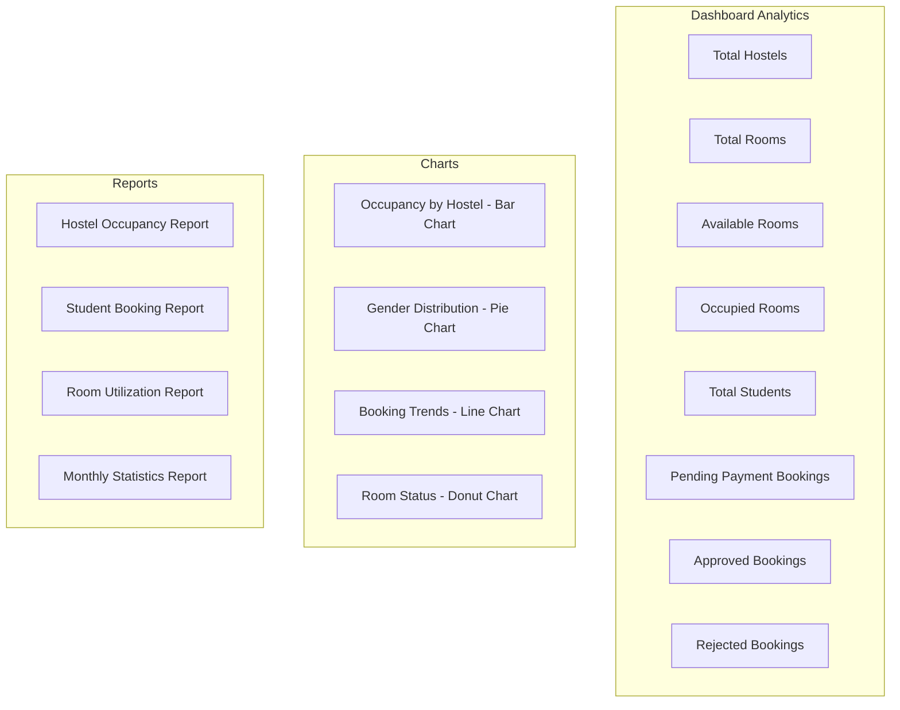

### Report Types

#### 1. Hostel Occupancy Report

| Field           | Description                          |
| --------------- | ------------------------------------ |
| Hostel Name     | Name of the hostel                   |
| Total Rooms     | Number of rooms in hostel            |
| Occupied Rooms  | Currently occupied rooms             |
| Available Rooms | Available for booking                |
| Occupancy Rate  | Percentage of rooms occupied         |
| Male Rooms      | Rooms designated for male students   |
| Female Rooms    | Rooms designated for female students |

**API Endpoint:** `GET /api/admin/reports/occupancy`

**Query Parameters:**

- `hostelId` (optional) - Filter by specific hostel
- `startDate` (optional) - Start date range
- `endDate` (optional) - End date range

**Response Example:**

```json
{
  "reportDate": "2026-02-13",
  "hostels": [
    {
      "hostelName": "Hostel A",
      "totalRooms": 50,
      "occupiedRooms": 42,
      "availableRooms": 8,
      "occupancyRate": 84.0,
      "maleRooms": 25,
      "femaleRooms": 25,
      "currentMaleOccupancy": 21,
      "currentFemaleOccupancy": 21
    }
  ],
  "summary": {
    "totalRooms": 150,
    "totalOccupied": 120,
    "overallOccupancyRate": 80.0
  }
}
```

#### 2. Student Booking Report

| Field            | Description               |
| ---------------- | ------------------------- |
| Student ID       | Unique identifier         |
| Student Name     | Full name                 |
| Email            | Contact email             |
| Gender           | Male/Female               |
| Booking Status   | Pending Payment/Approved/Rejected/Expired/Cancelled |
| Allocated Hostel | Assigned hostel name      |
| Allocated Room   | Room number               |
| Booking Date     | Date of booking request   |

**API Endpoint:** `GET /api/admin/reports/students`

**Query Parameters:**

- `status` (optional) - Filter by booking status
- `gender` (optional) - Filter by student gender
- `hostelId` (optional) - Filter by allocated hostel

#### 3. Room Utilization Report

| Field             | Description                 |
| ----------------- | --------------------------- |
| Room Number       | Room identifier             |
| Hostel Name       | Parent hostel               |
| Capacity          | Maximum occupants           |
| Current Occupancy | Current number of occupants |
| Gender Type       | Male/Female                 |
| Features          | AC, WiFi, Mattress Type     |
| Status            | Available/Full              |
| Utilization Rate  | Occupancy percentage        |

**API Endpoint:** `GET /api/admin/reports/rooms`

**Query Parameters:**

- `hostelId` (optional) - Filter by hostel
- `status` (optional) - Filter by room status
- `roomGender` (optional) - Filter by gender type

#### 4. Monthly Statistics Report

| Metric            | Description                    |
| ----------------- | ------------------------------ |
| New Registrations | Students registered this month |
| Total Bookings    | Bookings created this month    |
| Approved Bookings | Approved this month            |
| Rejected Bookings | Rejected this month            |
| Pending Payment Bookings  | Awaiting payment             |
| Cancellations     | Bookings cancelled             |

**API Endpoint:** `GET /api/admin/reports/monthly`

**Query Parameters:**

- `month` (optional) - Specific month (1-12)
- `year` (optional) - Specific year

### Analytics Charts

#### Occupancy by Hostel (Bar Chart)

Displays horizontal bar chart comparing occupancy rates across all hostels.

```javascript
// Frontend Component: OccupancyChart.js
const chartData = {
  labels: ['Hostel A', 'Hostel B', 'Hostel C'],
  datasets: [{
    label: 'Occupancy Rate (%)',
    data: [84, 72, 91],
    backgroundColor: ['#3B82F6', '#10B981', '#F59E0B']
  }]
};
```

#### Gender Distribution (Pie Chart)

Shows distribution of students by gender across all hostels.

```javascript
// Frontend Component: GenderChart.js
const chartData = {
  labels: ['Male Students', 'Female Students'],
  datasets: [{
    data: [450, 380],
    backgroundColor: ['#3B82F6', '#EC4899']
  }]
};
```

#### Booking Trends (Line Chart)

Displays booking trends over time (daily/weekly/monthly).

```javascript
// Frontend Component: BookingTrendsChart.js
const chartData = {
  labels: ['Jan', 'Feb', 'Mar', 'Apr', 'May', 'Jun'],
  datasets: [{
    label: 'Bookings',
    data: [65, 78, 90, 81, 95, 110],
    borderColor: '#3B82F6',
    fill: false
  }]
};
```

#### Room Status Distribution (Donut Chart)

Shows breakdown of room availability status.

```javascript
// Frontend Component: RoomStatusChart.js
const chartData = {
  labels: ['Available', 'Full', 'Maintenance'],
  datasets: [{
    data: [45, 100, 5],
    backgroundColor: ['#10B981', '#EF4444', '#F59E0B']
  }]
};
```

### Export Functionality

#### PDF Export

Generate printable PDF reports with:

- Header with university logo and report title
- Summary statistics
- Detailed data tables
- Charts and graphs
- Footer with generation date

**API Endpoint:** `GET /api/admin/reports/export/pdf`

**Implementation:**

```java
@Service
public class ReportExportService {
  
    public byte[] generateOccupancyPdf(ReportFilter filter) {
        // Using iText or Apache PDFBox
        // Generate PDF with tables and charts
    }
  
    public byte[] generateStudentPdf(ReportFilter filter) {
        // Generate student booking report PDF
    }
}
```

#### Excel Export

Export data to Excel spreadsheets for further analysis.

**API Endpoint:** `GET /api/admin/reports/export/excel`

**Implementation:**

```java
@Service
public class ReportExportService {
  
    public byte[] generateOccupancyExcel(ReportFilter filter) {
        // Using Apache POI
        // Create workbook with multiple sheets
    }
}
```

### Frontend Reports Components

```
src/components/Admin/Reports/
├── DashboardCards.js       # KPI cards for dashboard
├── OccupancyChart.js       # Bar chart for hostel occupancy
├── GenderChart.js          # Pie chart for gender distribution
├── BookingTrendsChart.js   # Line chart for booking trends
├── RoomStatusChart.js      # Donut chart for room status
├── OccupancyReport.js      # Detailed occupancy report table
├── StudentReport.js        # Student booking report table
├── RoomReport.js           # Room utilization report table
├── MonthlyStats.js         # Monthly statistics view
├── ExportButtons.js        # PDF/Excel export buttons
└── ReportFilters.js        # Date range and filter controls
```

### Report API Endpoints Summary

| Method | Endpoint                            | Description             |
| ------ | ----------------------------------- | ----------------------- |
| GET    | `/api/admin/reports/occupancy`    | Hostel occupancy report |
| GET    | `/api/admin/reports/students`     | Student booking report  |
| GET    | `/api/admin/reports/rooms`        | Room utilization report |
| GET    | `/api/admin/reports/monthly`      | Monthly statistics      |
| GET    | `/api/admin/reports/dashboard`    | Dashboard KPIs          |
| GET    | `/api/admin/reports/export/pdf`   | Export to PDF           |
| GET    | `/api/admin/reports/export/excel` | Export to Excel         |

### Dashboard KPIs

**API Endpoint:** `GET /api/admin/reports/dashboard`

**Response Example:**

```json
{
  "totalHostels": 5,
  "totalRooms": 250,
  "availableRooms": 50,
  "occupiedRooms": 200,
  "totalStudents": 450,
  "pendingPaymentBookings": 25,
  "approvedBookings": 380,
  "rejectedBookings": 45,
  "expiredBookings": 10,
  "occupancyRate": 80.0,
  "recentBookings": [
    {
      "id": 1,
      "studentName": "John Doe",
      "hostelName": "Hostel A",
      "roomNumber": "101",
      "status": "PENDING_PAYMENT",
      "date": "2026-02-13"
    }
  ]
}
```

---

## Payment Tracking Module

### Database Schema

#### payments Table

| Column         | Type                                          | Notes                          |
| -------------- | --------------------------------------------- | ------------------------------ |
| id             | PK                                            | Auto-increment                 |
| booking_id     | FK → bookings                                | Associated booking             |
| student_id     | FK → students                                | Student making payment         |
| amount         | decimal                                       | Payment amount                 |
| payment_method | ENUM(MOBILE_MONEY, BANK_TRANSFER, CASH, CARD) | Payment type                   |
| transaction_id | varchar                                       | External transaction reference |
| status         | ENUM(PENDING, COMPLETED, FAILED, REFUNDED)    | Payment status                 |
| payment_date   | datetime                                      | When payment was made          |
| due_date       | datetime                                      | Payment deadline               |
| created_at     | datetime                                      | Record creation time           |

### Entity Relationship

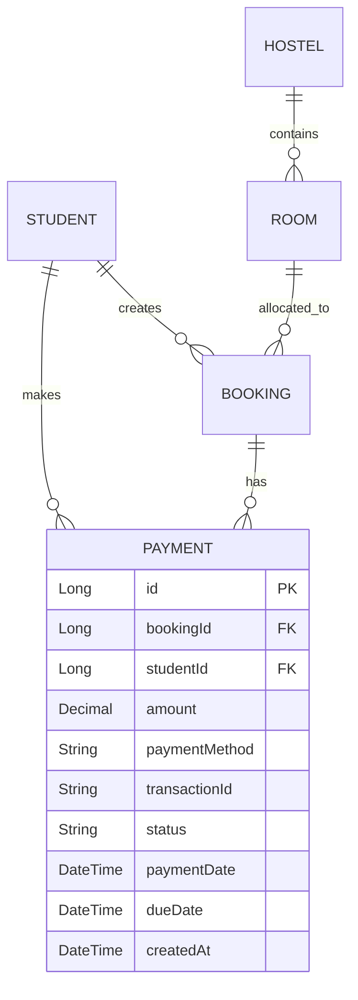

### Payment Flow

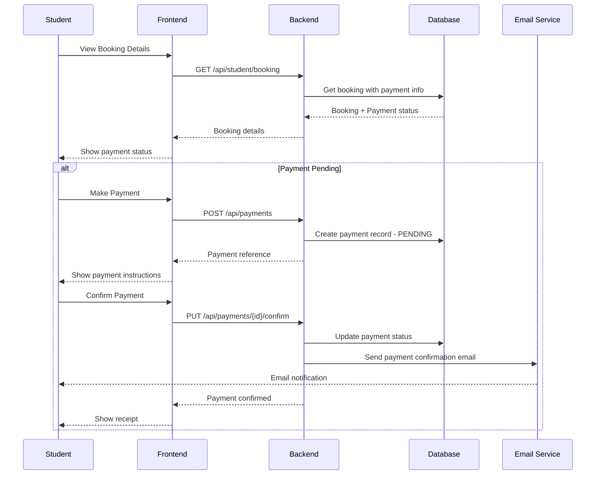

### Payment API Endpoints

| Method | Endpoint                       | Description           | Role                 |
| ------ | ------------------------------ | --------------------- | -------------------- |
| GET    | `/api/payments`              | List all payments     | Admin                |
| GET    | `/api/payments/{id}`         | Get payment details   | Admin, Student (own) |
| POST   | `/api/payments`              | Create payment record | Student              |
| PUT    | `/api/payments/{id}/confirm` | Confirm payment       | Admin                |
| PUT    | `/api/payments/{id}/fail`    | Mark payment failed   | Admin                |
| POST   | `/api/payments/{id}/refund`  | Process refund        | Admin                |
| GET    | `/api/student/payments`      | Get own payments      | Student              |
| GET    | `/api/payments/receipt/{id}` | Download receipt      | Admin, Student (own) |

### Payment Service Implementation

```java
@Service
public class PaymentService {
  
    public Payment createPayment(PaymentRequest request) {
        // Validate booking exists and belongs to student
        // Calculate amount based on room price
        // Create payment record with PENDING status
        // Set due date
    }
  
    public Payment confirmPayment(Long paymentId) {
        // Update payment status to COMPLETED
        // Update booking status if needed
        // Send confirmation email
        // Generate receipt
    }
  
    public void processRefund(Long paymentId, String reason) {
        // Update payment status to REFUNDED
        // Update booking status
        // Send refund notification email
    }
  
    public List<Payment> getOverduePayments() {
        // Find payments past due date with PENDING status
    }
}
```

### Frontend Payment Components

```
src/components/Payment/
├── PaymentForm.js          # Payment submission form
├── PaymentStatus.js        # Payment status display
├── PaymentHistory.js       # Payment history list
├── ReceiptDownload.js      # Receipt download button
└── PaymentAdmin.js         # Admin payment management
```

### Payment Dashboard Widget

```javascript
// Payment summary for admin dashboard
const paymentSummary = {
  totalCollected: 150000.00,
  pendingPayments: 25,
  overduePayments: 5,
  refundedAmount: 2000.00,
  recentPayments: [
    { student: "John Doe", amount: 500, date: "2026-02-13", status: "COMPLETED" }
  ]
};
```

---

## Email Notification System

### Notification Events

| Event             | Trigger                    | Recipients     | Template               |
| ----------------- | -------------------------- | -------------- | ---------------------- |
| Booking Created   | Student applies for hostel | Student, Admin | booking-created.html   |
| Booking Approved  | Admin approves booking     | Student        | booking-approved.html  |
| Booking Rejected  | Admin rejects booking      | Student        | booking-rejected.html  |
| Room Allocated    | System assigns room        | Student        | room-allocated.html    |
| Payment Reminder  | Payment due soon           | Student        | payment-reminder.html  |
| Payment Confirmed | Payment completed          | Student        | payment-confirmed.html |
| Payment Overdue   | Payment past due date      | Student, Admin | payment-overdue.html   |

### Email Flow

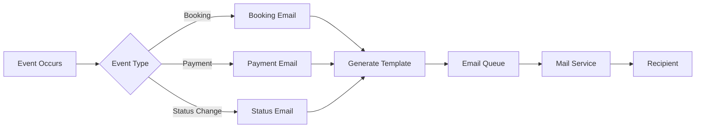

### Email Templates

#### Booking Confirmation Email

```html
<!-- templates/email/booking-created.html -->
<!DOCTYPE html>
<html>
<head>
    <style>
        body { font-family: Arial, sans-serif; }
        .header { background-color: #3B82F6; color: white; padding: 20px; }
        .content { padding: 20px; }
        .footer { background-color: #f3f4f6; padding: 10px; }
    </style>
</head>
<body>
    <div class="header">
        <h1>Hostel Booking Received</h1>
    </div>
    <div class="content">
        <p>Dear {{studentName}},</p>
        <p>Your hostel booking request has been received.</p>
        <p><strong>Booking Details:</strong></p>
        <ul>
            <li>Booking ID: {{bookingId}}</li>
            <li>Hostel: {{hostelName}}</li>
            <li>Status: {{status}}</li>
            <li>Date: {{bookingDate}}</li>
        </ul>
        <p>We will notify you once your booking is processed.</p>
    </div>
    <div class="footer">
        <p>University Hostel Management System</p>
    </div>
</body>
</html>
```

#### Booking Approved Email

```html
<!-- templates/email/booking-approved.html -->
<!DOCTYPE html>
<html>
<head>
    <style>
        body { font-family: Arial, sans-serif; }
        .header { background-color: #10B981; color: white; padding: 20px; }
        .content { padding: 20px; }
        .room-details { background-color: #f0fdf4; padding: 15px; border-radius: 8px; }
    </style>
</head>
<body>
    <div class="header">
        <h1>Booking Approved!</h1>
    </div>
    <div class="content">
        <p>Dear {{studentName}},</p>
        <p>Great news! Your hostel booking has been approved.</p>
        <div class="room-details">
            <h3>Your Room Allocation</h3>
            <ul>
                <li>Hostel: {{hostelName}}</li>
                <li>Room Number: {{roomNumber}}</li>
                <li>Floor: {{floor}}</li>
                <li>Room Type: {{roomType}}</li>
            </ul>
        </div>
        <p>Please proceed with payment to confirm your booking.</p>
        <p>Payment Due Date: {{dueDate}}</p>
    </div>
</body>
</html>
```

#### Payment Reminder Email

```html
<!-- templates/email/payment-reminder.html -->
<!DOCTYPE html>
<html>
<head>
    <style>
        body { font-family: Arial, sans-serif; }
        .header { background-color: #F59E0B; color: white; padding: 20px; }
        .content { padding: 20px; }
        .warning { color: #DC2626; font-weight: bold; }
    </style>
</head>
<body>
    <div class="header">
        <h1>Payment Reminder</h1>
    </div>
    <div class="content">
        <p>Dear {{studentName}},</p>
        <p>This is a friendly reminder that your payment is due soon.</p>
        <p><strong>Amount Due:</strong> {{amount}}</p>
        <p><strong>Due Date:</strong> {{dueDate}}</p>
        <p class="warning">Please make your payment before the due date to avoid cancellation.</p>
    </div>
</body>
</html>
```

### Email Service Implementation

```java
@Service
public class EmailService {
  
    @Autowired
    private JavaMailSender mailSender;
  
    @Autowired
    private TemplateEngine templateEngine;
  
    public void sendBookingConfirmation(Booking booking) {
        Context context = new Context();
        context.setVariable("studentName", booking.getStudent().getFullName());
        context.setVariable("bookingId", booking.getId());
        context.setVariable("hostelName", booking.getRoom().getHostel().getName());
        context.setVariable("status", booking.getStatus());
        context.setVariable("bookingDate", booking.getBookingDate());
      
        String htmlContent = templateEngine.process("booking-created", context);
      
        MimeMessage message = mailSender.createMimeMessage();
        MimeMessageHelper helper = new MimeMessageHelper(message, true);
        helper.setTo(booking.getStudent().getEmail());
        helper.setSubject("Hostel Booking Received");
        helper.setText(htmlContent, true);
      
        mailSender.send(message);
    }
  
    public void sendBookingApproval(Booking booking) {
        // Similar implementation for approval email
    }
  
    public void sendPaymentReminder(Payment payment) {
        // Send payment reminder before due date
    }
  
    public void sendPaymentConfirmation(Payment payment) {
        // Send confirmation after successful payment
    }
}
```

### Notification Preferences

Students can configure their notification preferences:

| Notification Type    | Email | SMS (Optional) |
| -------------------- | ----- | -------------- |
| Booking Updates      | ✓    | ✓             |
| Payment Reminders    | ✓    | ✓             |
| Room Allocation      | ✓    | ✗             |
| System Announcements | ✓    | ✓             |

### Scheduled Email Jobs

```java
@Component
public class EmailScheduler {
  
    @Autowired
    private PaymentService paymentService;
  
    @Autowired
    private EmailService emailService;
  
    // Run daily at 9 AM
    @Scheduled(cron = "0 0 9 * * ?")
    public void sendPaymentReminders() {
        List<Payment> upcomingDuePayments = paymentService.findPaymentsDueIn(3); // 3 days
        upcomingDuePayments.forEach(payment -> {
            emailService.sendPaymentReminder(payment);
        });
    }
  
    // Run daily at 10 AM
    @Scheduled(cron = "0 0 10 * * ?")
    public void sendOverdueNotifications() {
        List<Payment> overduePayments = paymentService.getOverduePayments();
        overduePayments.forEach(payment -> {
            emailService.sendOverdueNotification(payment);
        });
    }
}
```

### Email Configuration

```yaml
# application.yml
spring:
  mail:
    host: smtp.gmail.com
    port: 587
    username: ${MAIL_USERNAME}
    password: ${MAIL_PASSWORD}
    properties:
      mail:
        smtp:
          auth: true
          starttls:
            enable: true

app:
  email:
    from: noreply@university.edu
    enabled: true
```

### Backend Package Additions

```
com.hostelmanagement
│
├── service
│   ├── PaymentService.java        # NEW
│   └── EmailService.java          # NEW
│
├── repository
│   └── PaymentRepository.java     # NEW
│
├── model
│   └── Payment.java               # NEW
│
├── controller
│   └── PaymentController.java     # NEW
│
├── scheduler
│   └── EmailScheduler.java        # NEW
│
└── templates
    └── email/
        ├── booking-created.html
        ├── booking-approved.html
        ├── booking-rejected.html
        ├── room-allocated.html
        ├── payment-reminder.html
        ├── payment-confirmed.html
        └── payment-overdue.html
```

---

## Additional Features (Optional)

| Feature                   | Description                               | Status          |
| ------------------------- | ----------------------------------------- | --------------- |
| JWT Authentication        | Secure token-based authentication         | Planned         |
| Double Booking Validation | Prevent students from multiple bookings   | Planned         |
| Occupancy Analytics       | Dashboard showing hostel occupancy rates  | Planned         |
| Optimistic Locking        | Prevent double-booking race conditions    | **Added**       |
| 30-Min Payment Hold       | PENDING_PAYMENT status with expiration    | **Added**       |
| Booking Expiration        | Background scheduler for expired bookings | **Added**       |
| Global Exception Handler  | Standardized JSON error responses         | **Added**       |
| JPA Lifecycle Hooks       | Automatic room occupancy management       | **Added**       |
| Export Reports            | PDF/Excel export for booking reports      | Post-MVP        |
| Payment Module            | Track payment status for bookings         | **Added**       |
| Email Notifications       | Automated email alerts for status changes | **Added**       |
| Responsive Design         | Mobile-friendly UI with Tailwind CSS      | Planned         |
| Cloud Deployment          | AWS/Azure/GCP deployment                  | Post-MVP        |
| Payment Gateway           | Actual payment integration                | Post-MVP        |

---

## Next Steps

1. **Review this plan** and confirm it matches your requirements
2. **Switch to Code mode** to start implementation
3. **Create the Spring Boot project** with the defined dependencies
